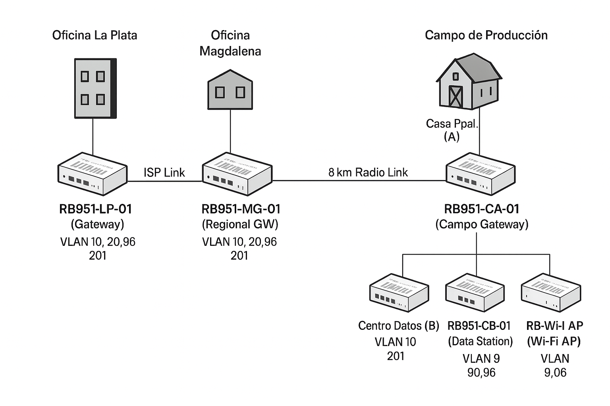

# Laboratorio de Radioenlaces para Empresa Agrotech
## Implementación de Infraestructura de Red Distribuida con MikroTik RB951ui-2HnD

### Autores

**Rodriguez Rodriguez Emanuel** Legajo 19288  
**Del Vecchio Guillermo Andrés**  Legajo N.º 27224

---

### **Universidad Tecnológica Nacional – Facultad Regional La Plata (UTN FRLP)**  
**Carrera:** Ingeniería en Sistemas. 

---

## Resumen 

Este documento presenta el diseño, implementación y configuración de una infraestructura de red distribuida para una empresa agrotech de producción ganadera, utilizando radioenlaces MikroTik RB951ui-2HnD. La solución integra oficinas en La Plata y Magdalena mediante ISPs mayorista y minorista, con extensión por radioenlace propio al establecimiento de producción rural.

**Palabras clave:** Radioenlaces, MikroTik, VLAN, Seguridad de redes, Agrotech, ISP, Última milla

---

## 1. Marco Teórico

### 1.1 Radioenlaces en Redes Empresariales
Los radioenlaces constituyen una tecnología esencial para garantizar la conectividad en entornos rurales, industriales y empresariales distribuidos, donde la implementación de infraestructura cableada resulta costosa o poco viable. Operan mediante la transmisión de señales electromagnéticas en espectros radioeléctricos específicos, permitiendo la comunicación de datos sin infraestructura física cableada.

### 1.2 Redes de Última Milla (Last Mile)

La **última milla** representa el segmento final que conecta al cliente con la red troncal del ISP. En entornos rurales, el despliegue directo de fibra óptica puede no ser económicamente viable. Las **tecnologías inalámbricas (WISP)** permiten extender conectividad mediante radioenlaces punto a punto (PtP) o punto a multipunto (PtMP).

### 1.3 Frontera de Capa 2 entre ISPs

La **frontera L2** entre un ISP mayorista y un ISP minorista permite el transporte transparente del tráfico de clientes finales a través de VLANs. El ISP mayorista provee servicios (IP, DHCP, NAT, routing), mientras que el ISP minorista solo entrega conectividad física local. Esta arquitectura es común en acuerdos de **wholesale** o **subcontratación de infraestructura**.

**Técnicas de Transporte VLAN:**
- **Q-in-Q (VLAN Stacking):** Encapsulación de VLANs cliente dentro de VLANs de transporte
- **EoIP (Ethernet over IP):** Túneles L2 seguros sobre IP que encapsulan tráfico Ethernet completo
- **WDS (Wireless Distribution System):** Sistema de distribución inalámbrico que permite conexión transparente entre APs

### 1.4 Tecnología MikroTik RouterBoard RB951ui-2HnD

**Especificaciones Técnicas Relevantes:**
El dispositivo cuenta con un procesador AR9344 de 600 MHz (MIPSBE, 1 núcleo) y una memoria compuesta por 128 MB de RAM y 128 MB de almacenamiento NAND. Opera en banda wireless de 2.4 GHz bajo el estándar 802.11 b/g/n, alcanzando velocidades de hasta 300 Mbps mediante dos cadenas de transmisión.
Dispone de cinco puertos Ethernet 10/100 Mbps, además de soporte PoE tanto de entrada (8–30 V) como de salida pasiva (500 mA en el puerto Ether5).
Integra una antena de 2.5 dBi para la banda de 2.4 GHz y ofrece un rango operativo de temperatura comprendido entre –20 °C y +60 °C.

**Ventajas para Radioenlaces:**
El equipo ofrece soporte nativo de WDS, lo que permite el transporte transparente de VLAN, facilitando la integración en redes distribuidas. Presenta un bajo consumo energético, de aproximadamente 7 W sin accesorios conectados, lo que lo hace eficiente para operaciones continuas. Su resistencia ambiental resulta adecuada para instalaciones en entornos rurales o con condiciones adversas, garantizando estabilidad y durabilidad. Además, se destaca por ser una solución costo-efectiva, ideal para implementaciones de radioenlaces distribuidos donde se prioriza la relación rendimiento-precio.

### 1.5 Protocolos de Seguridad y Transporte

#### 1.5.1 WDS (Wireless Distribution System)
Sistema que permite interconectar múltiples puntos de acceso de forma transparente, manteniendo un dominio L2 único. Esencial para el transporte de VLANs sobre radioenlaces.

#### 1.5.2 VLAN Tagging y Q-in-Q
- **802.1Q:** Etiquetado simple de VLANs
- **Q-in-Q:** Doble etiquetado para proveedores de servicios
- **VLAN Filtering:** Control granular de forwarding por VLAN

#### 1.5.3 Túneles EoIP
Encapsulación de frames Ethernet completos sobre IP, permitiendo transporte de VLANs a través de redes IP heterogéneas.

#### 1.5.4 Cifrado y Autenticación
- **WPA2-PSK AES:** Cifrado robusto para enlaces inalámbricos
- **IPSec:** Túneles seguros a nivel de red
- **Certificados digitales:** PKI para autenticación mutua

---

## 2. Contexto del Proyecto

### 2.1 Empresa Agrotech

La empresa **Agrotech** se especializa en el **sector de producción ganadera con tecnología de precisión**, orientando sus operaciones hacia la digitalización de procesos rurales y la optimización de recursos productivos. Su estructura organizativa se distribuye en distintas ubicaciones: las **oficinas centrales**, situadas en la ciudad de **La Plata, Buenos Aires**; las **oficinas regionales**, ubicadas en **Magdalena**, a aproximadamente 50 kilómetros de la sede principal; y el **establecimiento de producción**, localizado en un **campo rural a 8 kilómetros de Magdalena**, donde se concentran las actividades operativas y de monitoreo.

---

### 2.2 Infraestructura de Campo

La infraestructura de campo de Agrotech se compone de tres ubicaciones estratégicamente interconectadas que conforman el núcleo operativo de la red.

En la **Ubicación A – Casa Principal**, se encuentra el **centro de operaciones y administración local**, que actúa como **punto de interconexión principal** entre las demás sedes. En este sitio se aloja el **servidor local**, así como el **equipamiento informático (IT)** necesario para la gestión de la red y los servicios internos.

La **Ubicación B – Centro de Recolección de Datos** funciona como la **estación de procesamiento de información proveniente de drones y sensores**, donde se implementan **sistemas de inteligencia artificial** para el análisis y la toma de decisiones. En este punto también se lleva a cabo el **almacenamiento y procesamiento de datos críticos**, esenciales para la supervisión de la producción ganadera.

Por último, la **Ubicación C – Galpón y Corrales** concentra los **sistemas de monitoreo del ganado**, los **módulos de videovigilancia** y una red de **sensores IoT** dedicados al control de variables ambientales, alimentación y comportamiento en áreas de **feedlot y pastoreo**. Este entorno representa el principal foco de sensorización y análisis en tiempo real dentro del ecosistema productivo de la empresa.


---

## 3. Situación Problemática Detallada

### 3.1 Problema Central: Conectividad Rural Multi-Sitio

La empresa agrotech enfrenta un desafío complejo de conectividad que combina múltiples tecnologías y proveedores:

#### 3.1.1 Ausencia de Infraestructura Directa
- **La Plata ↔ Magdalena (50km):** Sin fibra óptica directa de la empresa
- **Magdalena ↔ Campo (8km):** Sin infraestructura de telecomunicaciones
- **Cobertura ISP limitada:** El ISP mayorista (Fiber Corp) no tiene presencia en Magdalena
- **Dependencia de terceros:** Necesidad de subcontratación de última milla

#### 3.1.2 Requerimientos de Frontera L2
**Problema específico:** 
- **ISP Mayorista (Fiber Corp)** provee conectividad hasta Magdalena pero requiere entrega en **frontera L2**
- **ISP Minorista (Cooperativa WISP)** tiene infraestructura local en Magdalena pero opera como carrier L2
- **Necesidad de transparencia:** Las VLANs corporativas deben atravesar ambos ISPs sin modificación

**Arquitectura de Subcontratación:**
```
[La Plata] ←→ [ISP Mayorista] ←→ [Frontera L2] ←→ [ISP Minorista] ←→ [Magdalena]
    ↑                                ↑                                    ↑
Servicios L3            Handoff Transparente                    Última Milla
(DHCP, NAT, FW)           (VLAN Tagging)                      (Conectividad Física)
```

#### 3.1.3 Complejidad de Transporte VLAN
**Desafío técnico:**
- **5 VLANs corporativas** deben ser transportadas transparentemente
- **Múltiples saltos:** La Plata → ISP Mayorista → ISP Minorista → Radioenlace → Campo
- **Integridad de servicios:** DHCP, DNS y otros servicios deben funcionar extremo a extremo
- **Aislamiento:** Tráfico de diferentes VLANs no debe interferir

#### 3.1.4 Restricciones de Radioenlace Rural
- **Distancias largas:** 8km requiere cálculos precisos de RF
- **Condiciones ambientales:** Variaciones climáticas extremas
- **Zona de Fresnel:** Posibles obstrucciones por vegetación o construcciones
- **Interferencia:** Banda 2.4GHz congestionada en entornos rurales

### 3.2 Solución Arquitectónica Propuesta

#### 3.2.1 Implementación de Frontera L2 Transparente
**En Magdalena (Punto de Interconexión):**
- **VLAN de Transporte:** Uso de VLAN 201 como trunk para todas las VLANs corporativas
- **Q-in-Q Stacking:** Encapsulación de VLANs cliente (10,20,90,96,201) dentro de VLAN de proveedor
- **EoIP Tunneling:** Túnel L2 sobre IP como alternativa para mayor seguridad

#### 3.2.2 WDS para Radioenlaces Transparentes
**Tecnología WDS (Wireless Distribution System):**
- **Dominio L2 extendido:** Bridge transparente entre sitios
- **VLAN-aware bridging:** Transporte múltiple de VLANs sobre radioenlace
- **Redundancia:** Posibilidad de múltiples enlaces WDS

#### 3.2.3 Centralización de Servicios
**Desde La Plata:**
- **DHCP Server:** Pools centralizados para todas las ubicaciones
- **DNS Resolución:** Servicios de nombres corporativos
- **Firewall/NAT:** Políticas de seguridad centralizadas
- **Gateway Internet:** Salida única controlada

### 3.3 Flujo de Datos Propuesto

```
[Datos VLAN 10,20,90,96,201] 
    ↓
[La Plata - RouterOS] → Servicios L3 + VLAN Tagging
    ↓
[ISP Mayorista] → Transporte transparente hasta Magdalena
    ↓
[Frontera L2 - Magdalena] → Handoff VLAN 201 (trunk)
    ↓
[ISP Minorista - WISP] → Conectividad local + AP WDS
    ↓
[Radioenlace 8km] → Station WDS + VLAN filtering
    ↓
[Campo A] → Bridge VLAN-aware + redistribución local
    ↓
[Campo B,C] → Station WDS + acceso final
```

### 3.4 Beneficios de la Arquitectura

#### 3.4.1 Técnicos
- **Transparencia L2:** VLANs intactas extremo a extremo
- **Centralización:** Gestión unificada desde La Plata
- **Escalabilidad:** Fácil adición de nuevas ubicaciones
- **Redundancia:** Posibilidad de enlaces backup

#### 3.4.2 Operacionales
- **Costo-efectivo:** Aprovecha infraestructura existente de ISPs
- **Gestión simplificada:** Un solo punto de administración
- **Compliance:** Mantiene políticas de seguridad corporativas
- **Flexibilidad:** Adaptable a cambios de proveedores

---

## 4. Protocolos de Seguridad para Radioenlaces

### 4.1 Arquitectura de Seguridad por Capas

#### 4.1.1 Capa Física
- **Potencia de transmisión controlada:** Minimización de la huella electromagnética
- **Antenas direccionales:** Reducción de interceptación por terceros
- **Encriptación a nivel de radio:** WPA2-Enterprise mínimo

#### 4.1.2 Capa de Enlace
- **802.1X:** Autenticación de puerto para dispositivos conectados
- **MAC Address Filtering:** Control de acceso basado en direcciones físicas
- **VLAN Isolation:** Segmentación de tráfico por función

#### 4.1.3 Capa de Red
- **IPSec Tunnels:** Encriptación extremo a extremo
- **Firewall Rules:** Control granular de tráfico
- **NAT Traversal:** Soporte para comunicaciones through NAT

### 4.2 Implementación de WPA2-Enterprise

```
# Configuración de autenticación empresarial
/interface wireless security-profiles
add name="agrotech-secure" mode=dynamic-keys authentication-types=wpa2-eap \
    eap-methods=eap-tls radius-mac-authentication=yes \
    radius-mac-mode=as-username-and-password
```

### 4.3 Configuración IPSec

La configuración del protocolo **IPSec** se diseñó con el objetivo de garantizar la **confidencialidad, integridad y autenticación** de los datos transmitidos entre los distintos nodos de la red. Este esquema de seguridad permite establecer túneles cifrados entre sedes, asegurando la protección frente a accesos no autorizados y la integridad del tráfico en entornos rurales distribuidos.

#### 4.3.1 Políticas de Encriptación

Las **políticas de encriptación** implementadas se basan en el uso del algoritmo **AES-256**, reconocido por su alto nivel de seguridad y eficiencia en hardware MikroTik. Para la validación de la integridad de los mensajes se utiliza el **hash SHA-256**, que garantiza resistencia frente a colisiones y ataques de fuerza bruta.  
El proceso de **intercambio de claves** se realiza mediante **Diffie-Hellman Group 14 o superior**, lo que permite establecer claves compartidas seguras durante la fase de negociación. Asimismo, se habilitó la función de **Perfect Forward Secrecy (PFS)**, que asegura que las claves generadas para cada sesión sean únicas y no puedan ser reutilizadas, reforzando la privacidad de las comunicaciones.

#### 4.3.2 Gestión de Certificados

En cuanto a la **gestión de certificados digitales**, se implementó una **Autoridad Certificadora (CA) interna** administrada por la propia empresa, lo que facilita el control y la emisión de credenciales seguras para cada dispositivo autorizado. Los certificados se configuran con un **período de validez de un año** y cuentan con un sistema de **renovación automática**, evitando interrupciones en la autenticación.  
Para mantener la integridad del sistema, se utiliza una **Lista de Revocación de Certificados (CRL)** que se **actualiza semanalmente**, garantizando la inmediata anulación de credenciales comprometidas o caducadas.

---

## 5. Desarrollo de Ingeniería de Red

### 5.1 Arquitectura de Transporte por Capas

#### 5.1.1 Capa de Servicios (La Plata)
**Servicios Centralizados:**
- **DHCP:** Pools para todas las VLANs y ubicaciones
- **DNS:** Resolución de nombres corporativos + forwarding público
- **Firewall:** Políticas centralizadas de seguridad
- **NAT:** Traducción de direcciones para salida a Internet
- **Routing:** Tablas de rutas para interconexión entre sitios

#### 5.1.2 Capa de Transporte ISP
**Frontera L2 en Magdalena:**
- **ISP Mayorista → ISP Minorista:** Handoff transparente VLAN 201
- **Q-in-Q Encapsulation:** VLANs cliente (10,20,90,96,201) dentro de VLAN 201
- **Bandwidth Management:** SLA garantizado por acuerdo entre ISPs

#### 5.1.3 Capa de Radioenlace
**WDS Implementation:**
- **Magdalena → Campo A:** AP WDS con VLAN 201 como trunk
- **Campo A → B,C:** Station WDS con bridge VLAN-aware
- **Frecuencias separadas:** Evitar interferencia entre enlaces

### 5.2 Topología Detallada con WDS

```
                    FRONTERA L2 Y RADIOENLACES WDS

[La Plata - Servicios]                [Magdalena - ISP Handoff]           [Campo - WDS Distribution]
┌─────────────────────┐              ┌─────────────────────────┐         ┌─────────────────────────┐
│   RouterOS Principal │              │   RB951-MG-01           │         │   RB951-CA-01           │
│                     │              │   (AP WDS)              │         │   (Station WDS + AP)    │
│ DHCP Pools:         │◄────────────►│                         │◄────────┤                         │
│ • 192.168.10.0/24   │   ISP Links  │ VLAN 201 Trunk:         │ 8km RF  │ WDS Bridge:             │
│ • 192.168.20.0/24   │   (50km)     │ • Contains all client   │         │ • VLAN decomposition    │
│ • 192.168.90.0/24   │              │   VLANs (10,20,90,96)  │         │ • Local redistribution  │
│ • 192.168.96.0/24   │              │ • Q-in-Q encapsulation │         │ • Enlaces a B,C         │
│ • 192.168.201.0/24  │              │                         │         │                         │
│                     │              │ WDS Mode: AP            │         │ WDS Mode: Station+AP    │
│ NAT + Firewall      │              │ Channel: 6 (2437MHz)   │         │ Channel: 6 (2437MHz)   │
└─────────────────────┘              └─────────────────────────┘         └─────────────────────────┘
                                                                                   │        │
                                                                         ┌─────────┴──┐  ┌──┴─────────┐
                                                                         │  Campo B   │  │  Campo C   │
                                                                         │ RB951-CB-01│  │RB951-CC-01 │
                                                                         │(Station WDS)│  │(Station WDS)│
                                                                         │Ch.11(2462) │  │Ch.1(2412)  │
                                                                         └────────────┘  └────────────┘
```

### 5.3 Esquema de Direccionamiento Optimizado

#### 5.3.1 Red de Gestión y Transporte
- **Gestión de equipos:** 10.200.1.0/24
- **Enlaces PtP:** 10.200.2.0/30, 10.200.2.4/30, 10.200.2.8/30
- **VLAN de transporte:** VLAN 201 (trunk entre ISPs)

#### 5.3.2 VLANs Cliente Corporativas

**Esquema unificado por función:**
| VLAN | Función | La Plata | Magdalena | Campo A | Campo B | Campo C |
|------|---------|----------|-----------|---------|---------|---------|
| 10 | Servidores | 192.168.10.0/24 | 192.168.10.0/24 | 192.168.10.0/24 | 192.168.10.0/24 | N/A |
| 20 | Escritorio | 192.168.20.0/24 | 192.168.20.0/24 | 192.168.20.0/24 | 192.168.20.0/24 | 192.168.20.0/24 |
| 90 | WiFi Privada | 192.168.90.0/24 | 192.168.90.0/24 | 192.168.90.0/24 | 192.168.90.0/24 | 192.168.90.0/24 |
| 96 | WiFi Invitados | 192.168.96.0/24 | 192.168.96.0/24 | 192.168.96.0/24 | N/A | N/A |
| 201 | CCTV | 192.168.201.0/24 | 192.168.201.0/24 | 192.168.201.0/24 | 192.168.201.0/24 | 192.168.201.0/24 |

**Ventajas del esquema unificado:**
- **Simplicidad de routing:** Mismo subnet en todas las ubicaciones
- **DHCP centralizado:** Un solo pool por VLAN desde La Plata
- **Broadcast domains:** Separados por ubicación física vía WDS
- **Gestión simplificada:** Políticas uniformes de firewall

### 5.4 Inventario de Equipos Actualizado

#### 5.4.1 Identificación con Roles WDS

| Ubicación | Hostname | Función Principal | IP Gestión | Modo Wireless | Canal/Freq |
|-----------|----------|------------------|------------|---------------|------------|
| La Plata | agrotech-lp-gw | Gateway + Servicios | 10.200.1.1 | N/A | N/A |
| Magdalena | agrotech-mg-ap | AP WDS (ISP Handoff) | 10.200.1.10 | AP-WDS | 6/2437MHz |
| Campo A | agrotech-ca-gw | Station-WDS + AP local | 10.200.1.20 | Station-WDS + AP | 6/2437MHz |
| Campo B | agrotech-cb-st | Station WDS | 10.200.1.21 | Station-WDS | 11/2462MHz |
| Campo C | agrotech-cc-st | Station WDS | 10.200.1.22 | Station-WDS | 1/2412MHz |

### 5.5 Configuración de Radioenlaces WDS

#### 5.5.1 Enlace Principal Magdalena ↔ Campo A

**Cálculo de Enlace Actualizado:**
- **Distancia:** 8km
- **Frecuencia:** 2437MHz (Canal 6)
- **Potencia Tx:** 20dBm (ambos extremos)
- **Ganancia antena:** 2.5dBi x 2 = 5dB
- **Pérdida espacio libre:** 20*log10(8000) + 20*log10(2437) - 27.55 = 106.2dB
- **Budget de enlace:** 20dBm + 5dB - 106.2dB = -81.2dBm
- **Sensibilidad RX requerida:** -96dBm (54Mbps)
- **Margen de desvanecimiento:** 14.8dB ✓ (aceptable)

**Configuración WDS:**
```routeros
# En Magdalena (AP WDS)
/interface wireless
set wlan1 mode=ap-bridge band=2ghz-b/g/n frequency=2437 \
    ssid="AGROTECH-BACKBONE" channel-width=20mhz \
    wds-mode=dynamic wds-default-bridge=BR-WDS

# En Campo A (Station WDS)  
/interface wireless
set wlan1 mode=station-wds band=2ghz-b/g/n frequency=2437 \
    ssid="AGROTECH-BACKBONE" channel-width=20mhz \
    wds-mode=dynamic wds-default-bridge=BR-WDS
```

#### 5.5.2 Enlaces Secundarios Campo A ↔ B,C

**Separación de frecuencias para evitar interferencia:**
- **A ↔ B:** Canal 11 (2462MHz) - 2km
- **A ↔ C:** Canal 1 (2412MHz) - 1.5km

**Configuración optimizada para distancias cortas:**
```routeros
# Reducir potencia para enlaces cortos
/interface wireless
set wlan1 tx-power=15 # Para enlaces <2km
```

### 5.6 Implementación Q-in-Q para ISP

#### 5.6.1 Concepto de VLAN Stacking

```
Original Frame:    [Eth Header][VLAN 20 Tag][Data][FCS]
                            ↓ Q-in-Q Encapsulation
ISP Transport:     [Eth Header][VLAN 201 Tag][VLAN 20 Tag][Data][FCS]
                            ↓ At destination
Restored Frame:    [Eth Header][VLAN 20 Tag][Data][FCS]
```

#### 5.6.2 Configuración Q-in-Q en Frontera

```routeros
# En punto de interconexión ISP
/interface bridge
add name=BR-ISP-BORDER vlan-filtering=yes

# VLAN 201 como Service Provider VLAN
/interface vlan
add interface=ether1-isp name=SP-VLAN201 vlan-id=201

# Customer VLANs dentro de SP-VLAN
/interface bridge vlan
add bridge=BR-ISP-BORDER tagged=SP-VLAN201,wlan1 vlan-ids=10,20,90,96,201
```

---

## 6. Diagrama de Red Profesional

### 6.1 Topología Física

```
                    EMPRESA AGROTECH - INFRAESTRUCTURA DE RED
    
    [OFICINA LA PLATA]                [OFICINA MAGDALENA]                [CAMPO DE PRODUCCIÓN]
    ┌─────────────────┐              ┌──────────────────┐               ┌─────────────────────┐
    │   Data Center   │              │  Oficina Reg.    │               │     Casa Ppal.      │
    │                 │              │                  │               │       (A)           │
    │ RB951-LP-01     │◄────────────►│ RB951-MG-01      │◄─────────────►│ RB951-CA-01         │
    │ (Gateway)       │   ISP Link   │ (Regional GW)    │  8km Radio    │ (Campo Gateway)     │
    │                 │   50km       │                  │   Link        │                     │
    │ VLAN 10,20,90,  │              │ VLAN 10,20,90,   │               │ VLAN 10,20,90,      │
    │      96,201     │              │      96,201      │               │      96,201         │
    │                 │              │                  │               │                     │
    │ 192.168.100.10  │              │ 192.168.100.20   │               │ 192.168.101.1       │
    └─────────────────┘              └──────────────────┘               └─────────┬───────────┘
                                                                                   │
                   ┌─────────────────────────────────────────────────────────────┼────────────┐
                   │                                                             │            │
                   ▼                                                             ▼            ▼
        ┌──────────────────┐                                           ┌─────────────┐ ┌─────────────┐
        │Centro Datos (B)  │                                           │ Galpón (C)  │ │ AP Indoor   │
        │                  │                                           │             │ │             │
        │ RB951-CB-01      │                                           │RB951-CC-01  │ │RB951-CA-02  │
        │ (Data Station)   │                                           │(Ganado St.) │ │(WiFi AP)    │
        │                  │                                           │             │ │             │
        │ VLAN 10,20,90,201│                                           │VLAN 20,90,  │ │VLAN 90,96   │
        │                  │                                           │     201     │ │             │
        │ 192.168.101.5    │                                           │192.168.101.9│ │10.3.90.1    │
        └──────────────────┘                                           └─────────────┘ └─────────────┘
             2km Radio                                                       1.5km Radio
```

### 6.2 Esquema Lógico de VLANs

```
                        SEGMENTACIÓN DE VLANS POR UBICACIÓN
    
    VLAN 10 (Servidores)     ┌──────────────────────────────────────────────┐
    [10.1.10.0/24] ←────────→│             BACKBONE ISP                     │←────────→ [10.2.10.0/24]
    [10.3.10.0/24] ←────────→│          + RADIOENLACES                      │←────────→ [10.4.10.0/24]
                             │                                              │           [10.5.10.0/24]
    VLAN 20 (Escritorio)     │                                              │
    [10.1.20.0/24] ←────────→│    Transporte Transparente de VLANs          │←────────→ [10.2.20.0/24]
    [10.3.20.0/24] ←────────→│         mediante 802.1Q Tagging              │←────────→ [10.4.20.0/24]
                             │                                              │           [10.5.20.0/24]
    VLAN 90 (WiFi Priv)      │                                              │
    [10.1.90.0/24] ←────────→│                                              │←────────→ [10.2.90.0/24]
    [10.3.90.0/24] ←────────→│                                              │←────────→ [10.4.90.0/24]
                             │                                              │           [10.5.90.0/24]
    VLAN 96 (WiFi Guest)     │                                              │
    [10.1.96.0/24] ←────────→│                                              │←────────→ [10.2.96.0/24]
    [10.3.96.0/24] ←────────→│                                              │
                             │                                              │
    VLAN 201 (VideoVig)      │                                              │
    [10.1.201.0/24] ←───────→│                                              │←────────→ [10.2.201.0/24]
    [10.3.201.0/24] ←───────→│                                              │←────────→ [10.4.201.0/24]
                             │                                              │           [10.5.201.0/24]
                             └──────────────────────────────────────────────┘
         LA PLATA                        TRANSPORTE                            MAGDALENA
                                                                                 CAMPO
```

---

## 7. Configuración de Dispositivos

### 7.1 RB951-LP-01 (Gateway La Plata)

**Función:** Router principal de oficina central con conexión a ISP mayorista.

**Configuración Base:**
- **Hostname:** agrotech-lp-gw
- **IP de gestión:** 192.168.100.10/24
- **Función principal:** Gateway, DHCP Server, Firewall

**Interfaces:**
- **ether1:** Conexión WAN ISP (DHCP Client)
- **ether2-5:** LAN Switch con VLANs
- **wlan1:** Backup wireless (deshabilitado por defecto)

**VLANs Configuradas:**
- **VLAN 10:** Servidores (10.1.10.0/24)
- **VLAN 20:** Escritorio (10.1.20.0/24)
- **VLAN 90:** WiFi Privada (10.1.90.0/24)
- **VLAN 96:** WiFi Invitados (10.1.96.0/24)
- **VLAN 201:** Videovigilancia (10.1.201.0/24)

### 7.2 RB951-MG-01 (Gateway Magdalena)

**Función:** Router regional con conexión a ISP minorista y enlace de campo.

**Configuración Base:**
- **Hostname:** agrotech-mg-gw
- **IP de gestión:** 192.168.100.20/24
- **Función principal:** Gateway regional, Bridge VLAN

**Interfaces:**
- **ether1:** Conexión ISP minorista
- **ether2-4:** LAN local
- **ether5:** Conexión PoE a antena externa
- **wlan1:** Radioenlace a campo (AP Bridge)

### 7.3 RB951-CA-01 (Gateway Campo A)

**Función:** Gateway principal del campo con distribución a ubicaciones B y C.

**Configuración Base:**
- **Hostname:** agrotech-ca-gw
- **IP de gestión:** 192.168.101.1/30
- **Función principal:** Router de campo, DHCP local, Bridge

**Radioenlaces:**
- **wlan1:** Enlace principal con Magdalena (Station Bridge)
- **Enlaces secundarios:** Distribución interna a B y C

### 7.4 RB951-CB-01 (Estación Campo B)

**Función:** Estación de trabajo para centro de datos de drones.

**Configuración Base:**
- **Hostname:** agrotech-cb-st
- **IP de gestión:** 192.168.101.5/30
- **Función principal:** Station Bridge, Switch local

### 7.5 RB951-CC-01 (Estación Campo C)

**Función:** Estación de trabajo para galpón y corrales.

**Configuración Base:**
- **Hostname:** agrotech-cc-st
- **IP de gestión:** 192.168.101.9/30
- **Función principal:** Station Bridge, Switch local

### 7.6 RB951-CA-02 (Access Point Interior)

**Función:** Punto de acceso WiFi para casa principal.

**Configuración Base:**
- **Hostname:** agrotech-ca-ap
- **IP de gestión:** 10.3.90.1/24
- **Función principal:** Access Point dual-band

---

## 8. Herramientas, Protocolos y Metodología

### 8.1 Herramientas de Configuración

#### 8.1.1 WinBox
- **Función:** Interfaz gráfica principal para configuración
- **Versión recomendada:** 3.40+
- **Uso:** Configuración inicial y monitoreo

#### 8.1.2 RouterOS CLI
- **Función:** Configuración por línea de comandos
- **Acceso:** SSH, Telnet, Serial
- **Uso:** Automatización y scripting

#### 8.1.3 Web Interface
- **Función:** Interfaz web para monitoreo básico
- **Puerto:** 80/443
- **Uso:** Visualización de estado

### 8.2 Protocolos Implementados

#### 8.2.1 Capa de Enlace
- **802.11n:** Comunicación inalámbrica
- **802.1Q:** VLAN Tagging
- **802.1X:** Autenticación de puerto

#### 8.2.2 Capa de Red
- **OSPF:** Protocolo de routing dinámico
- **DHCP:** Asignación automática de IPs
- **DNS:** Resolución de nombres

#### 8.2.3 Capa de Transporte
- **TCP/UDP:** Protocolos de transporte
- **IPSec:** Túneles seguros

#### 8.2.4 Capa de Aplicación
- **SNMP:** Monitoreo de red
- **NTP:** Sincronización de tiempo
- **Syslog:** Registro de eventos

### 8.3 Metodología de Implementación

#### 8.3.1 Fase 1: Planificación
1. **Análisis de requerimientos**
2. **Diseño de topología**
3. **Cálculo de radioenlaces**
4. **Planificación de direccionamiento**

#### 8.3.2 Fase 2: Configuración Base
1. **Actualización de RouterOS**
2. **Configuración de interfaces**
3. **Implementación de VLANs**
4. **Configuración de DHCP**

#### 8.3.3 Fase 3: Radioenlaces
1. **Configuración de parámetros RF**
2. **Alineación de antenas**
3. **Optimización de señal**
4. **Pruebas de throughput**

#### 8.3.4 Fase 4: Seguridad
1. **Implementación de firewall**
2. **Configuración de VPN**
3. **Autenticación de usuarios**
4. **Monitoreo de seguridad**

#### 8.3.5 Fase 5: Monitoreo
1. **Configuración SNMP**
2. **Alertas automatizadas**
3. **Dashboards de monitoreo**
4. **Respaldo de configuraciones**

---

## 9. Anexos

### Anexo A: Configuraciones CLI Completas

#### A.1 RouterOS Principal - La Plata (Simulado)

```routeros
# Configuración inicial del sistema
/system identity
set name=agrotech-lp-gw

# Configuración básica de sistema
/system clock
set time-zone-name=America/Argentina/Buenos_Aires

# Crear bridge principal VLAN-aware
/interface bridge
add name=BR-MAIN vlan-filtering=yes protocol-mode=rstp

# Configuración de interfaces VLAN para servicios corporativos
/interface vlan
add interface=ether1 name=VLAN10-Servidores vlan-id=10 comment="Servidores ERP/BD"
add interface=ether1 name=VLAN20-Escritorio vlan-id=20 comment="Estaciones de trabajo"
add interface=ether1 name=VLAN90-WiFi-Priv vlan-id=90 comment="WiFi personal autorizado"
add interface=ether1 name=VLAN96-WiFi-Guest vlan-id=96 comment="WiFi invitados"
add interface=ether1 name=VLAN201-CCTV vlan-id=201 comment="Video vigilancia"

# Asignar interfaces al bridge principal
/interface bridge port
add bridge=BR-MAIN interface=ether2
add bridge=BR-MAIN interface=VLAN10-Servidores
add bridge=BR-MAIN interface=VLAN20-Escritorio
add bridge=BR-MAIN interface=VLAN90-WiFi-Priv
add bridge=BR-MAIN interface=VLAN96-WiFi-Guest
add bridge=BR-MAIN interface=VLAN201-CCTV

# Configuración VLAN filtering en bridge
/interface bridge vlan
add bridge=BR-MAIN tagged=ether1,ether2 vlan-ids=10,20,90,96,201

# Asignación de direcciones IP por VLAN
/ip address
add address=192.168.10.1/24 interface=VLAN10-Servidores comment="Gateway Servidores"
add address=192.168.20.1/24 interface=VLAN20-Escritorio comment="Gateway Escritorio"
add address=192.168.90.1/24 interface=VLAN90-WiFi-Priv comment="Gateway WiFi Privada"
add address=192.168.96.1/24 interface=VLAN96-WiFi-Guest comment="Gateway WiFi Invitados"
add address=192.168.201.1/24 interface=VLAN201-CCTV comment="Gateway CCTV"
add address=10.200.1.1/24 interface=ether3 comment="Red de gestion"

# Configuración de pools DHCP centralizados
/ip pool
add name=POOL-Escritorio ranges=192.168.20.10-192.168.20.200 comment="Pool VLAN 20"
add name=POOL-WiFi-Priv ranges=192.168.90.10-192.168.90.200 comment="Pool VLAN 90"
add name=POOL-WiFi-Guest ranges=192.168.96.10-192.168.96.200 comment="Pool VLAN 96"
add name=POOL-CCTV ranges=192.168.201.50-192.168.201.200 comment="Pool VLAN 201"

# Servidores DHCP por VLAN
/ip dhcp-server
add name=DHCP-Escritorio interface=VLAN20-Escritorio address-pool=POOL-Escritorio \
    disabled=no lease-time=8h
add name=DHCP-WiFi-Priv interface=VLAN90-WiFi-Priv address-pool=POOL-WiFi-Priv \
    disabled=no lease-time=4h  
add name=DHCP-WiFi-Guest interface=VLAN96-WiFi-Guest address-pool=POOL-WiFi-Guest \
    disabled=no lease-time=1h
add name=DHCP-CCTV interface=VLAN201-CCTV address-pool=POOL-CCTV \
    disabled=no lease-time=24h

# Redes DHCP con DNS y gateway
/ip dhcp-server network
add address=192.168.20.0/24 gateway=192.168.20.1 dns-server=192.168.10.5,8.8.8.8 \
    comment="Red Escritorio" domain=agrotech.local
add address=192.168.90.0/24 gateway=192.168.90.1 dns-server=192.168.10.5,8.8.8.8 \
    comment="Red WiFi Privada" domain=agrotech.local
add address=192.168.96.0/24 gateway=192.168.96.1 dns-server=8.8.8.8,8.8.4.4 \
    comment="Red WiFi Invitados"
add address=192.168.201.0/24 gateway=192.168.201.1 dns-server=192.168.10.5 \
    comment="Red CCTV" domain=agrotech.local

# Configuración de rutas hacia sitios remotos
/ip route
add dst-address=0.0.0.0/0 gateway=dhcp-client comment="Default route"

# Configuración de firewall con políticas por VLAN
/ip firewall filter
# Input chain - acceso a router
add action=accept chain=input connection-state=established,related comment="Allow established"
add action=accept chain=input src-address=192.168.10.0/24 comment="Servers full access"
add action=accept chain=input src-address=10.200.1.0/24 comment="Management network"
add action=accept chain=input protocol=icmp comment="Allow ICMP"
add action=accept chain=input dst-port=53 protocol=udp src-address=192.168.0.0/16 comment="Allow DNS"
add action=accept chain=input dst-port=67 protocol=udp src-address=0.0.0.0/0 comment="Allow DHCP"
add action=drop chain=input comment="Drop all other input"

# Forward chain - inter-VLAN routing
add action=accept chain=forward connection-state=established,related comment="Allow established"
add action=accept chain=forward src-address=192.168.10.0/24 comment="Servers can access all"
add action=accept chain=forward src-address=192.168.20.0/24 dst-address=192.168.10.0/24 \
    comment="Desktop to servers"
add action=accept chain=forward src-address=192.168.90.0/24 dst-address=192.168.10.0/24,192.168.20.0/24 \
    comment="WiFi private to internal"
add action=drop chain=forward src-address=192.168.96.0/24 dst-address=192.168.0.0/16 \
    comment="Block guest to internal"
add action=accept chain=forward src-address=192.168.201.0/24 dst-address=192.168.10.0/24 \
    comment="CCTV to servers"
add action=accept chain=forward comment="Allow remaining traffic"

# NAT para salida a Internet
/ip firewall nat
add action=masquerade chain=srcnat out-interface=ether1 comment="Internet NAT"

# Configuración de DNS
/ip dns
set servers=8.8.8.8,8.8.4.4,1.1.1.1 allow-remote-requests=yes cache-size=5000KiB

# Configuración de NTP
/system ntp client
set enabled=yes primary-ntp=pool.ntp.org secondary-ntp=time.google.com

# Configuración de logging
/system logging action
add name=remote-log remote=192.168.10.10 remote-port=514 target=remote

/system logging
add action=remote-log topics=system,error,critical,warning

# Configuración de SNMP
/snmp
set enabled=yes contact="admin@agrotech.com" location="La Plata - Centro de Datos" \
    trap-community=agrotech-traps trap-version=2

# Usuarios del sistema
/user
add name=admin-agrotech group=full password="Agr0t3ch2024!" comment="Admin principal"
add name=soporte-red group=read password="S0p0rt3R3d!" comment="Soporte técnico"
add name=monitoreo group=read password="M0n1t0r30!" comment="Sistema de monitoreo"
```

#### A.2 RB951-MG-01 (ISP Handoff - AP WDS Magdalena)

```routeros
# Configuración inicial del sistema
/system identity
set name=agrotech-mg-ap

/system clock  
set time-zone-name=America/Argentina/Buenos_Aires

# Configuración de wireless como AP WDS
/interface wireless security-profiles
add name=WDS-Security mode=dynamic-keys authentication-types=wpa2-psk \
    unicast-ciphers=aes-ccm group-ciphers=aes-ccm \
    wpa2-pre-shared-key="Agr0t3chWDS2024!"

/interface wireless
set [ find default-name=wlan1 ] band=2ghz-b/g/n channel-width=20mhz \
    country=argentina frequency=2437 mode=ap-bridge \
    ssid="AGROTECH-BACKBONE" security-profile=WDS-Security \
    wds-mode=dynamic wds-default-bridge=BR-WDS \
    wds-cost-range=0 wds-default-cost=0 tx-power=20

# Bridge WDS con VLAN filtering
/interface bridge
add name=BR-WDS vlan-filtering=yes protocol-mode=rstp

# VLAN 201 como trunk para Q-in-Q
/interface vlan
add interface=ether1 name=SP-VLAN201 vlan-id=201 comment="Service Provider VLAN"

# Asignar interfaces al bridge WDS
/interface bridge port
add bridge=BR-WDS interface=wlan1 comment="Wireless WDS"
add bridge=BR-WDS interface=SP-VLAN201 comment="ISP uplink"
add bridge=BR-WDS interface=ether2 comment="Local mgmt"

# Configuración VLAN filtering - transportar VLANs cliente dentro de 201
/interface bridge vlan
add bridge=BR-WDS tagged=wlan1,SP-VLAN201 vlan-ids=10,20,90,96,201
add bridge=BR-WDS tagged=ether2 untagged=ether3,ether4,ether5 vlan-ids=200

# IP de gestión en VLAN separada
/interface vlan
add interface=BR-WDS name=MGMT-VLAN vlan-id=200

/ip address
add address=10.200.1.10/24 interface=MGMT-VLAN comment="IP gestion"

# Ruta por defecto hacia La Plata
/ip route
add dst-address=0.0.0.0/0 gateway=10.200.1.1

# Configuración de firewall básica
/ip firewall filter
add action=accept chain=input connection-state=established,related
add action=accept chain=input src-address=10.200.1.0/24 protocol=tcp dst-port=22,8291
add action=accept chain=input protocol=icmp
add action=drop chain=input

add action=accept chain=forward

# Configuración de NTP
/system ntp client
set enabled=yes primary-ntp=10.200.1.1

# Configuración de SNMP
/snmp
set enabled=yes contact="admin@agrotech.com" location="Magdalena - ISP Handoff"

# Script de monitoreo de enlace
/system script
add name=link-monitor source=\
":local linkStatus [/interface wireless get wlan1 running]
:if (\$linkStatus != true) do={
    /log error \"Wireless link down - attempting reset\"
    /interface wireless reset wlan1
}"

/system scheduler
add interval=5m name=wireless-watchdog on-event=link-monitor start-time=startup
```

#### A.3 RB951-CA-01 (Campo A - Station WDS + AP Local)

```routeros
# Configuración inicial del sistema
/system identity
set name=agrotech-ca-gw

/system clock
set time-zone-name=America/Argentina/Buenos_Aires

# Configuración de wireless como Station WDS
/interface wireless security-profiles
add name=WDS-Security mode=dynamic-keys authentication-types=wpa2-psk \
    unicast-ciphers=aes-ccm group-ciphers=aes-ccm \
    wpa2-pre-shared-key="Agr0t3chWDS2024!"

# Interface principal - Station WDS hacia Magdalena
/interface wireless
set [ find default-name=wlan1 ] band=2ghz-b/g/n channel-width=20mhz \
    country=argentina frequency=2437 mode=station-wds \
    ssid="AGROTECH-BACKBONE" security-profile=WDS-Security \
    wds-mode=dynamic wds-default-bridge=BR-MAIN \
    tx-power=20 scan-list=2437

# Bridge principal VLAN-aware
/interface bridge
add name=BR-MAIN vlan-filtering=yes protocol-mode=rstp

# Crear VLANs locales
/interface vlan
add interface=BR-MAIN name=VLAN10-Local vlan-id=10 comment="Servidores Campo A"
add interface=BR-MAIN name=VLAN20-Local vlan-id=20 comment="Escritorio Campo A"
add interface=BR-MAIN name=VLAN90-Local vlan-id=90 comment="WiFi Privada Campo A"
add interface=BR-MAIN name=VLAN96-Local vlan-id=96 comment="WiFi Invitados Campo A"
add interface=BR-MAIN name=VLAN201-Local vlan-id=201 comment="CCTV Campo A"

# VLAN de gestión
/interface vlan
add interface=BR-MAIN name=MGMT-Local vlan-id=200 comment="Gestión local"

# Asignar puertos al bridge
/interface bridge port
add bridge=BR-MAIN interface=wlan1 comment="WDS uplink"
add bridge=BR-MAIN interface=ether2 comment="Switch local"
add bridge=BR-MAIN interface=ether3 comment="Servidores locales"
add bridge=BR-MAIN interface=ether4 comment="Expansion"

# VLAN filtering - todas las VLANs cliente + gestión
/interface bridge vlan
add bridge=BR-MAIN tagged=wlan1,ether2,ether5 vlan-ids=10,20,90,96,201
add bridge=BR-MAIN tagged=ether2,ether4 untagged=ether3 vlan-ids=200

# IP de gestión
/ip address
add address=10.200.1.20/24 interface=MGMT-Local comment="IP gestión Campo A"

# Enlaces WDS hacia B y C usando interfaces virtuales
/interface wireless
add disabled=no master-interface=wlan1 name=wlan-to-B \
    ssid="AGROTECH-CAMPO-B" wds-cost-range=0 wds-default-cost=0 \
    wds-mode=dynamic multicast-buffering=disabled tx-power=15

add disabled=no master-interface=wlan1 name=wlan-to-C \
    ssid="AGROTECH-CAMPO-C" wds-cost-range=0 wds-default-cost=0 \
    wds-mode=dynamic multicast-buffering=disabled tx-power=15

# Configurar frecuencias separadas para evitar interferencia
/interface wireless
set wlan-to-B frequency=2462 # Canal 11
set wlan-to-C frequency=2412 # Canal 1

# Agregar enlaces secundarios al bridge
/interface bridge port
add bridge=BR-MAIN interface=wlan-to-B comment="Enlace Campo B"
add bridge=BR-MAIN interface=wlan-to-C comment="Enlace Campo C"

# Ruta por defecto
/ip route
add dst-address=0.0.0.0/0 gateway=10.200.1.1

# Configuración de firewall
/ip firewall filter
add action=accept chain=input connection-state=established,related
add action=accept chain=input src-address=10.200.1.0/24,192.168.0.0/16
add action=accept chain=input protocol=icmp
add action=drop chain=input

add action=accept chain=forward

# DHCP Relay hacia La Plata (opcional para servicios locales)
/ip dhcp-relay
add dhcp-server=192.168.20.1 interface=VLAN20-Local name=relay-vlan20 disabled=yes
add dhcp-server=192.168.90.1 interface=VLAN90-Local name=relay-vlan90 disabled=yes

# Configuración de NTP
/system ntp client  
set enabled=yes primary-ntp=10.200.1.1

# Configuración de SNMP
/snmp
set enabled=yes contact="admin@agrotech.com" location="Campo A - Casa Principal"

# Script de monitoreo multi-enlace
/system script
add name=multi-link-monitor source=\
":local mainLink [/interface wireless get wlan1 running]
:local linkB [/interface wireless get wlan-to-B registered-clients]
:local linkC [/interface wireless get wlan-to-C registered-clients]

:if (\$mainLink != true) do={
    /log error \"Main WDS link down\"
    /interface wireless reset wlan1
}

:log info \"Link Status - Main: \$mainLink, B clients: \$linkB, C clients: \$linkC\""

/system scheduler
add interval=2m name=multi-link-check on-event=multi-link-monitor start-time=startup
```

#### A.4 RB951-CB-01 (Campo B - Station WDS)

```routeros
# Configuración inicial del sistema
/system identity
set name=agrotech-cb-st

/system clock
set time-zone-name=America/Argentina/Buenos_Aires

# Configuración de wireless como Station WDS
/interface wireless security-profiles
add name=WDS-Security mode=dynamic-keys authentication-types=wpa2-psk \
    unicast-ciphers=aes-ccm group-ciphers=aes-ccm \
    wpa2-pre-shared-key="Agr0t3chWDS2024!"

/interface wireless
set [ find default-name=wlan1 ] band=2ghz-b/g/n channel-width=20mhz \
    country=argentina frequency=2462 mode=station-wds \
    ssid="AGROTECH-CAMPO-B" security-profile=WDS-Security \
    wds-mode=dynamic wds-default-bridge=BR-CAMPO-B \
    tx-power=15 scan-list=2462

# Bridge local VLAN-aware
/interface bridge
add name=BR-CAMPO-B vlan-filtering=yes protocol-mode=rstp

# VLANs necesarias en Campo B
/interface vlan
add interface=BR-CAMPO-B name=VLAN10-B vlan-id=10 comment="Servidores drones"
add interface=BR-CAMPO-B name=VLAN20-B vlan-id=20 comment="Escritorio Campo B"
add interface=BR-CAMPO-B name=VLAN90-B vlan-id=90 comment="WiFi Privada B"
add interface=BR-CAMPO-B name=VLAN201-B vlan-id=201 comment="CCTV Campo B"
add interface=BR-CAMPO-B name=MGMT-B vlan-id=200 comment="Gestión Campo B"

# Asignar puertos
/interface bridge port
add bridge=BR-CAMPO-B interface=wlan1 comment="WDS link to A"
add bridge=BR-CAMPO-B interface=ether2 comment="Local switch"
add bridge=BR-CAMPO-B interface=ether3 comment="Servidores drones"
add bridge=BR-CAMPO-B interface=ether4 comment="Workstations"

# VLAN filtering
/interface bridge vlan
add bridge=BR-CAMPO-B tagged=wlan1,ether2 vlan-ids=10,20,90,201
add bridge=BR-CAMPO-B tagged=ether2 untagged=ether3,ether4,ether5 vlan-ids=200

# IP de gestión
/ip address
add address=10.200.1.21/24 interface=MGMT-B comment="IP gestión Campo B"

# Ruta por defecto
/ip route
add dst-address=0.0.0.0/0 gateway=10.200.1.1

# Configuración de firewall básica
/ip firewall filter
add action=accept chain=input connection-state=established,related
add action=accept chain=input src-address=10.200.1.0/24,192.168.0.0/16
add action=accept chain=input protocol=icmp
add action=drop chain=input

add action=accept chain=forward

# Configuración de NTP
/system ntp client
set enabled=yes primary-ntp=10.200.1.1

# Configuración de SNMP
/snmp
set enabled=yes contact="admin@agrotech.com" location="Campo B - Centro de Datos Drones"

# Script de monitoreo específico para servicios de drones
/system script
add name=drone-services-monitor source=\
":local wdsStatus [/interface wireless get wlan1 registered]
:local cpuLoad [/system resource get cpu-load]
:local freeMemory [/system resource get free-memory]

:if (\$wdsStatus != true) do={
    /log error \"WDS connection lost - drone services affected\"
}

:if (\$cpuLoad > 70) do={
    /log warning \"High CPU load on drone station: \$cpuLoad%\"
}

:log info \"Campo B Status - WDS: \$wdsStatus, CPU: \$cpuLoad%, Free RAM: \$freeMemory MB\""

/system scheduler
add interval=1m name=drone-monitor on-event=drone-services-monitor start-time=startup
```

#### A.5 RB951-CC-01 (Campo C - Station WDS)

```routeros
# Configuración inicial del sistema
/system identity
set name=agrotech-cc-st

/system clock
set time-zone-name=America/Argentina/Buenos_Aires

# Configuración de wireless como Station WDS
/interface wireless security-profiles
add name=WDS-Security mode=dynamic-keys authentication-types=wpa2-psk \
    unicast-ciphers=aes-ccm group-ciphers=aes-ccm \
    wpa2-pre-shared-key="Agr0t3chWDS2024!"

/interface wireless
set [ find default-name=wlan1 ] band=2ghz-b/g/n channel-width=20mhz \
    country=argentina frequency=2412 mode=station-wds \
    ssid="AGROTECH-CAMPO-C" security-profile=WDS-Security \
    wds-mode=dynamic wds-default-bridge=BR-CAMPO-C \
    tx-power=15 scan-list=2412

# Bridge local VLAN-aware
/interface bridge
add name=BR-CAMPO-C vlan-filtering=yes protocol-mode=rstp

# VLANs para galpón y corrales
/interface vlan
add interface=BR-CAMPO-C name=VLAN20-C vlan-id=20 comment="Escritorio Campo C"
add interface=BR-CAMPO-C name=VLAN90-C vlan-id=90 comment="WiFi Privada C"
add interface=BR-CAMPO-C name=VLAN201-C vlan-id=201 comment="CCTV Corrales"
add interface=BR-CAMPO-C name=MGMT-C vlan-id=200 comment="Gestión Campo C"

# Asignar puertos
/interface bridge port
add bridge=BR-CAMPO-C interface=wlan1 comment="WDS link to A"
add bridge=BR-CAMPO-C interface=ether2 comment="Local switch"
add bridge=BR-CAMPO-C interface=ether3 comment="CCTV equipment"
add bridge=BR-CAMPO-C interface=ether4 comment="Workstation"
add bridge=BR-CAMPO-C interface=ether5 comment="Feedlot sensors"

# VLAN filtering - solo VLANs necesarias
/interface bridge vlan
add bridge=BR-CAMPO-C tagged=wlan1,ether2 vlan-ids=20,90,201
add bridge=BR-CAMPO-C tagged=ether2 untagged=ether3,ether4,ether5 vlan-ids=200

# IP de gestión
/ip address
add address=10.200.1.22/24 interface=MGMT-C comment="IP gestión Campo C"

# Ruta por defecto
/ip route
add dst-address=0.0.0.0/0 gateway=10.200.1.1

# Configuración de firewall
/ip firewall filter
add action=accept chain=input connection-state=established,related
add action=accept chain=input src-address=10.200.1.0/24,192.168.0.0/16
add action=accept chain=input protocol=icmp
add action=drop chain=input

add action=accept chain=forward

# Configuración de NTP
/system ntp client
set enabled=yes primary-ntp=10.200.1.1

# Configuración de SNMP
/snmp
set enabled=yes contact="admin@agrotech.com" location="Campo C - Galpón y Corrales"

# Script de monitoreo para equipos de corral
/system script
add name=livestock-monitor source=\
":local wdsStatus [/interface wireless get wlan1 registered]
:local temp [/system health get temperature]
:local voltage [/system health get voltage]

:if (\$wdsStatus != true) do={
    /log error \"WDS connection lost - livestock monitoring affected\"
}

:if (\$temp > 60) do={
    /log warning \"High temperature in livestock station: \$temp°C\"
}

:log info \"Campo C Status - WDS: \$wdsStatus, Temp: \$temp°C, Voltage: \$voltage V\""

/system scheduler
add interval=1m name=livestock-check on-event=livestock-monitor start-time=startup
```

#### A.2 RB951-MG-01 (Gateway Magdalena)

```routeros
# Configuración inicial del sistema
/system identity
set name=agrotech-mg-gw

# Configuración de interfaces VLAN
/interface vlan
add interface=ether2 name=vlan10-servers vlan-id=10
add interface=ether2 name=vlan20-desktop vlan-id=20
add interface=ether2 name=vlan90-wifi-private vlan-id=90
add interface=ether2 name=vlan96-wifi-guest vlan-id=96
add interface=ether2 name=vlan201-cctv vlan-id=201

# Configuración de wireless para radioenlace
/interface wireless
set [ find default-name=wlan1 ] band=2ghz-b/g/n channel-width=20mhz country=argentina \
    disabled=no frequency=2437 mode=ap-bridge ssid=agrotech-campo-link \
    wireless-protocol=802.11 wps-mode=disabled

# Configuración de seguridad wireless
/interface wireless security-profiles
set [ find default=yes ] authentication-types=wpa2-psk mode=dynamic-keys \
    wpa2-pre-shared-key="Agr0t3chC4mp0Link2024!"

# Configuración de bridge
/interface bridge
add name=bridge-local

/interface bridge port
add bridge=bridge-local interface=ether3
add bridge=bridge-local interface=ether4
add bridge=bridge-local interface=wlan1
add bridge=bridge-local interface=vlan10-servers
add bridge=bridge-local interface=vlan20-desktop
add bridge=bridge-local interface=vlan90-wifi-private
add bridge=bridge-local interface=vlan96-wifi-guest
add bridge=bridge-local interface=vlan201-cctv

# Configuración de direcciones IP
/ip address
add address=192.168.100.20/24 interface=ether1 comment="ISP Connection"
add address=10.2.10.1/24 interface=vlan10-servers comment="Servidores"
add address=10.2.20.1/24 interface=vlan20-desktop comment="Escritorio"
add address=10.2.90.1/24 interface=vlan90-wifi-private comment="WiFi Privada"
add address=10.2.96.1/24 interface=vlan96-wifi-guest comment="WiFi Invitados"
add address=10.2.201.1/24 interface=vlan201-cctv comment="CCTV"

# Configuración de DHCP Server
/ip pool
add name=pool-vlan20-mg ranges=10.2.20.10-10.2.20.200
add name=pool-vlan90-mg ranges=10.2.90.10-10.2.90.200
add name=pool-vlan96-mg ranges=10.2.96.10-10.2.96.200

/ip dhcp-server
add address-pool=pool-vlan20-mg disabled=no interface=vlan20-desktop name=dhcp-vlan20-mg
add address-pool=pool-vlan90-mg disabled=no interface=vlan90-wifi-private name=dhcp-vlan90-mg
add address-pool=pool-vlan96-mg disabled=no interface=vlan96-wifi-guest name=dhcp-vlan96-mg

/ip dhcp-server network
add address=10.2.20.0/24 dns-server=10.1.10.5 gateway=10.2.20.1
add address=10.2.90.0/24 dns-server=10.1.10.5 gateway=10.2.90.1
add address=10.2.96.0/24 dns-server=8.8.8.8,8.8.4.4 gateway=10.2.96.1

# Configuración de rutas estáticas
/ip route
add dst-address=10.1.0.0/16 gateway=192.168.100.10 comment="La Plata Networks"
add dst-address=10.3.0.0/16 gateway=192.168.101.1 comment="Campo A Networks"
add dst-address=10.4.0.0/16 gateway=192.168.101.1 comment="Campo B Networks"
add dst-address=10.5.0.0/16 gateway=192.168.101.1 comment="Campo C Networks"

# Configuración de firewall (similar a La Plata con adaptaciones)
/ip firewall filter
add action=accept chain=input connection-state=established,related
add action=accept chain=input src-address=10.0.0.0/8
add action=accept chain=input protocol=icmp
add action=accept chain=input dst-port=22,80,443,8291 protocol=tcp src-address=10.2.10.0/24
add action=drop chain=input

add action=accept chain=forward connection-state=established,related
add action=accept chain=forward

# Configuración de NTP
/system ntp client
set enabled=yes primary-ntp=10.1.10.5 secondary-ntp=pool.ntp.org

# Configuración de SNMP
/snmp
set enabled=yes contact="admin@agrotech.com" location="Magdalena Regional"
```

#### A.3 RB951-CA-01 (Gateway Campo A)

```routeros
# Configuración inicial del sistema
/system identity
set name=agrotech-ca-gw

# Configuración de wireless para enlace principal
/interface wireless
set [ find default-name=wlan1 ] band=2ghz-b/g/n channel-width=20mhz country=argentina \
    disabled=no frequency=2437 mode=station-bridge wireless-protocol=802.11 \
    wps-mode=disabled

# Configuración de seguridad wireless
/interface wireless security-profiles
set [ find default=yes ] authentication-types=wpa2-psk mode=dynamic-keys \
    wpa2-pre-shared-key="Agr0t3chC4mp0Link2024!"

# Conectar a AP de Magdalena
/interface wireless
set [ find default-name=wlan1 ] ssid=agrotech-campo-link

# Configuración de interfaces VLAN
/interface vlan
add interface=ether2 name=vlan10-servers vlan-id=10
add interface=ether2 name=vlan20-desktop vlan-id=20
add interface=ether2 name=vlan90-wifi-private vlan-id=90
add interface=ether2 name=vlan96-wifi-guest vlan-id=96
add interface=ether2 name=vlan201-cctv vlan-id=201

# Configuración de bridge
/interface bridge
add name=bridge-main

/interface bridge port
add bridge=bridge-main interface=wlan1
add bridge=bridge-main interface=ether3
add bridge=bridge-main interface=ether4
add bridge=bridge-main interface=vlan10-servers
add bridge=bridge-main interface=vlan20-desktop
add bridge=bridge-main interface=vlan90-wifi-private
add bridge=bridge-main interface=vlan96-wifi-guest
add bridge=bridge-main interface=vlan201-cctv

# Configuración de direcciones IP
/ip address
add address=192.168.101.1/30 interface=bridge-main comment="Campo Gateway"
add address=10.3.10.1/24 interface=vlan10-servers comment="Servidores"
add address=10.3.20.1/24 interface=vlan20-desktop comment="Escritorio"
add address=10.3.90.1/24 interface=vlan90-wifi-private comment="WiFi Privada"
add address=10.3.96.1/24 interface=vlan96-wifi-guest comment="WiFi Invitados"
add address=10.3.201.1/24 interface=vlan201-cctv comment="CCTV"

# Configuración para enlaces secundarios
/interface wireless
add disabled=no master-interface=wlan1 multicast-buffering=disabled name=wlan-campo-b \
    ssid=agrotech-campo-b wds-cost-range=0 wds-default-cost=0 wps-mode=disabled

add disabled=no master-interface=wlan1 multicast-buffering=disabled name=wlan-campo-c \
    ssid=agrotech-campo-c wds-cost-range=0 wds-default-cost=0 wps-mode=disabled

# Configuración de DHCP Server
/ip pool
add name=pool-vlan20-ca ranges=10.3.20.10-10.3.20.200
add name=pool-vlan90-ca ranges=10.3.90.10-10.3.90.200
add name=pool-vlan96-ca ranges=10.3.96.10-10.3.96.200

/ip dhcp-server
add address-pool=pool-vlan20-ca disabled=no interface=vlan20-desktop name=dhcp-vlan20-ca
add address-pool=pool-vlan90-ca disabled=no interface=vlan90-wifi-private name=dhcp-vlan90-ca
add address-pool=pool-vlan96-ca disabled=no interface=vlan96-wifi-guest name=dhcp-vlan96-ca

/ip dhcp-server network
add address=10.3.20.0/24 dns-server=10.1.10.5 gateway=10.3.20.1
add address=10.3.90.0/24 dns-server=10.1.10.5 gateway=10.3.90.1
add address=10.3.96.0/24 dns-server=8.8.8.8,8.8.4.4 gateway=10.3.96.1

# Configuración de rutas
/ip route
add dst-address=0.0.0.0/0 gateway=192.168.100.20 comment="Default via Magdalena"
add dst-address=10.4.0.0/16 gateway=192.168.101.5 comment="Campo B"
add dst-address=10.5.0.0/16 gateway=192.168.101.9 comment="Campo C"

# Configuración de firewall
/ip firewall filter
add action=accept chain=input connection-state=established,related
add action=accept chain=input src-address=10.0.0.0/8
add action=accept chain=input protocol=icmp
add action=accept chain=input dst-port=22,80,443,8291 protocol=tcp src-address=10.3.10.0/24
add action=drop chain=input

add action=accept chain=forward

# Configuración de NTP
/system ntp client
set enabled=yes primary-ntp=10.1.10.5

# Configuración de SNMP
/snmp
set enabled=yes contact="admin@agrotech.com" location="Campo A - Casa Principal"
```

#### A.4 RB951-CB-01 (Estación Campo B)

```routeros
# Configuración inicial del sistema
/system identity
set name=agrotech-cb-st

# Configuración de wireless en modo station
/interface wireless
set [ find default-name=wlan1 ] band=2ghz-b/g/n channel-width=20mhz country=argentina \
    disabled=no frequency=2462 mode=station-bridge ssid=agrotech-campo-b \
    wireless-protocol=802.11 wps-mode=disabled

# Configuración de seguridad wireless
/interface wireless security-profiles
set [ find default=yes ] authentication-types=wpa2-psk mode=dynamic-keys \
    wpa2-pre-shared-key="Agr0t3chC4mp0Link2024!"

# Configuración de interfaces VLAN
/interface vlan
add interface=ether2 name=vlan10-servers vlan-id=10
add interface=ether2 name=vlan20-desktop vlan-id=20
add interface=ether2 name=vlan90-wifi-private vlan-id=90
add interface=ether2 name=vlan201-cctv vlan-id=201

# Configuración de bridge
/interface bridge
add name=bridge-campo-b

/interface bridge port
add bridge=bridge-campo-b interface=wlan1
add bridge=bridge-campo-b interface=ether3
add bridge=bridge-campo-b interface=ether4
add bridge=bridge-campo-b interface=ether5
add bridge=bridge-campo-b interface=vlan10-servers
add bridge=bridge-campo-b interface=vlan20-desktop
add bridge=bridge-campo-b interface=vlan90-wifi-private
add bridge=bridge-campo-b interface=vlan201-cctv

# Configuración de direcciones IP
/ip address
add address=192.168.101.5/30 interface=bridge-campo-b comment="Campo B Station"
add address=10.4.10.1/24 interface=vlan10-servers comment="Servidores B"
add address=10.4.20.1/24 interface=vlan20-desktop comment="Escritorio B"
add address=10.4.90.1/24 interface=vlan90-wifi-private comment="WiFi Privada B"
add address=10.4.201.1/24 interface=vlan201-cctv comment="CCTV B"

# Configuración de DHCP Server local
/ip pool
add name=pool-vlan20-cb ranges=10.4.20.10-10.4.20.50
add name=pool-vlan90-cb ranges=10.4.90.10-10.4.90.50

/ip dhcp-server
add address-pool=pool-vlan20-cb disabled=no interface=vlan20-desktop name=dhcp-vlan20-cb
add address-pool=pool-vlan90-cb disabled=no interface=vlan90-wifi-private name=dhcp-vlan90-cb

/ip dhcp-server network
add address=10.4.20.0/24 dns-server=10.1.10.5 gateway=10.4.20.1
add address=10.4.90.0/24 dns-server=10.1.10.5 gateway=10.4.90.1

# Configuración de ruta por defecto
/ip route
add dst-address=0.0.0.0/0 gateway=192.168.101.1 comment="Default via Campo A"

# Configuración básica de firewall
/ip firewall filter
add action=accept chain=input connection-state=established,related
add action=accept chain=input src-address=10.0.0.0/8
add action=accept chain=input protocol=icmp
add action=drop chain=input

add action=accept chain=forward

# Configuración de NTP
/system ntp client
set enabled=yes primary-ntp=10.1.10.5

# Configuración de SNMP
/snmp
set enabled=yes contact="admin@agrotech.com" location="Campo B - Centro Datos"
```

#### A.5 RB951-CC-01 (Estación Campo C)

```routeros
# Configuración inicial del sistema
/system identity
set name=agrotech-cc-st

# Configuración de wireless en modo station
/interface wireless
set [ find default-name=wlan1 ] band=2ghz-b/g/n channel-width=20mhz country=argentina \
    disabled=no frequency=2412 mode=station-bridge ssid=agrotech-campo-c \
    wireless-protocol=802.11 wps-mode=disabled

# Configuración de seguridad wireless
/interface wireless security-profiles
set [ find default=yes ] authentication-types=wpa2-psk mode=dynamic-keys \
    wpa2-pre-shared-key="Agr0t3chC4mp0Link2024!"

# Configuración de interfaces VLAN
/interface vlan
add interface=ether2 name=vlan20-desktop vlan-id=20
add interface=ether2 name=vlan90-wifi-private vlan-id=90
add interface=ether2 name=vlan201-cctv vlan-id=201

# Configuración de bridge
/interface bridge
add name=bridge-campo-c

/interface bridge port
add bridge=bridge-campo-c interface=wlan1
add bridge=bridge-campo-c interface=ether3
add bridge=bridge-campo-c interface=ether4
add bridge=bridge-campo-c interface=ether5
add bridge=bridge-campo-c interface=vlan20-desktop
add bridge=bridge-campo-c interface=vlan90-wifi-private
add bridge=bridge-campo-c interface=vlan201-cctv

# Configuración de direcciones IP
/ip address
add address=192.168.101.9/30 interface=bridge-campo-c comment="Campo C Station"
add address=10.5.20.1/24 interface=vlan20-desktop comment="Escritorio C"
add address=10.5.90.1/24 interface=vlan90-wifi-private comment="WiFi Privada C"
add address=10.5.201.1/24 interface=vlan201-cctv comment="CCTV C"

# Configuración de DHCP Server local
/ip pool
add name=pool-vlan20-cc ranges=10.5.20.10-10.5.20.50
add name=pool-vlan90-cc ranges=10.5.90.10-10.5.90.50

/ip dhcp-server
add address-pool=pool-vlan20-cc disabled=no interface=vlan20-desktop name=dhcp-vlan20-cc
add address-pool=pool-vlan90-cc disabled=no interface=vlan90-wifi-private name=dhcp-vlan90-cc

/ip dhcp-server network
add address=10.5.20.0/24 dns-server=10.1.10.5 gateway=10.5.20.1
add address=10.5.90.0/24 dns-server=10.1.10.5 gateway=10.5.90.1

# Configuración de ruta por defecto
/ip route
add dst-address=0.0.0.0/0 gateway=192.168.101.1 comment="Default via Campo A"

# Configuración básica de firewall
/ip firewall filter
add action=accept chain=input connection-state=established,related
add action=accept chain=input src-address=10.0.0.0/8
add action=accept chain=input protocol=icmp
add action=drop chain=input

add action=accept chain=forward

# Configuración de NTP
/system ntp client
set enabled=yes primary-ntp=10.1.10.5

# Configuración de SNMP
/snmp
set enabled=yes contact="admin@agrotech.com" location="Campo C - Galpon"
```

#### A.6 RB951-CA-02 (Access Point Interior)

```routeros
# Configuración inicial del sistema
/system identity
set name=agrotech-ca-ap

# Configuración de wireless como AP
/interface wireless
set [ find default-name=wlan1 ] band=2ghz-b/g/n channel-width=20mhz country=argentina \
    disabled=no frequency=2452 mode=ap-bridge ssid=AgroTech-WiFi \
    wireless-protocol=802.11 wps-mode=disabled

# Configuración de perfiles de seguridad para múltiples SSIDs
/interface wireless security-profiles
add authentication-types=wpa2-psk group-ciphers=aes-ccm mode=dynamic-keys name=wifi-private \
    unicast-ciphers=aes-ccm wpa2-pre-shared-key="Agr0T3chWiFi2024!"

add authentication-types=wpa2-psk group-ciphers=aes-ccm mode=dynamic-keys name=wifi-guest \
    unicast-ciphers=aes-ccm wpa2-pre-shared-key="Gu3st2024!"

# Configuración de SSID adicional para invitados
/interface wireless
add disabled=no master-interface=wlan1 multicast-buffering=disabled name=wlan-guest \
    security-profile=wifi-guest ssid=AgroTech-Guest wds-cost-range=0 wds-default-cost=0 \
    wps-mode=disabled

# Configurar perfil de seguridad para SSID principal
/interface wireless
set [ find default-name=wlan1 ] security-profile=wifi-private

# Configuración de interfaces VLAN
/interface vlan
add interface=ether2 name=vlan90-wifi-private vlan-id=90
add interface=ether2 name=vlan96-wifi-guest vlan-id=96

# Configuración de bridge separados para aislamiento
/interface bridge
add name=bridge-private
add name=bridge-guest

/interface bridge port
add bridge=bridge-private interface=wlan1
add bridge=bridge-private interface=vlan90-wifi-private
add bridge=bridge-private interface=ether3
add bridge=bridge-private interface=ether4

add bridge=bridge-guest interface=wlan-guest  
add bridge=bridge-guest interface=vlan96-wifi-guest
add bridge=bridge-guest interface=ether5

# Configuración de direcciones IP
/ip address
add address=10.3.90.1/24 interface=bridge-private comment="WiFi Privada"
add address=10.3.96.1/24 interface=bridge-guest comment="WiFi Invitados"

# Configuración de DHCP para ambas redes
/ip pool
add name=pool-wifi-private ranges=10.3.90.50-10.3.90.200
add name=pool-wifi-guest ranges=10.3.96.10-10.3.96.200

/ip dhcp-server
add address-pool=pool-wifi-private disabled=no interface=bridge-private name=dhcp-wifi-private
add address-pool=pool-wifi-guest disabled=no interface=bridge-guest name=dhcp-wifi-guest

/ip dhcp-server network
add address=10.3.90.0/24 dns-server=10.1.10.5 gateway=10.3.90.1
add address=10.3.96.0/24 dns-server=8.8.8.8,8.8.4.4 gateway=10.3.96.1

# Configuración de firewall para aislamiento de invitados
/ip firewall filter
add action=accept chain=input connection-state=established,related
add action=accept chain=input src-address=10.3.90.0/24
add action=accept chain=input protocol=icmp
add action=drop chain=input src-address=10.3.96.0/24
add action=drop chain=input

add action=accept chain=forward connection-state=established,related
add action=accept chain=forward src-address=10.3.90.0/24
add action=drop chain=forward src-address=10.3.96.0/24 dst-address=10.0.0.0/8
add action=accept chain=forward src-address=10.3.96.0/24
add action=accept chain=forward

# Configuración de NTP
/system ntp client
set enabled=yes primary-ntp=10.3.90.1

# Configuración de SNMP
/snmp
set enabled=yes contact="admin@agrotech.com" location="Campo A - AP Interior"
```

### Anexo B: Capa de Seguridad y Gestión de Identidades

#### B.1 Política de Seguridad General

**Principios de Seguridad:**
1. **Defensa en profundidad:** Múltiples capas de protección
2. **Principio de menor privilegio:** Acceso mínimo necesario
3. **Segregación de redes:** Aislamiento por función
4. **Autenticación fuerte:** WPA2-Enterprise mínimo
5. **Encriptación:** AES-256 para todos los enlaces

#### B.2 Configuración de Certificados Digitales

```routeros
# Generar CA interna
/certificate
add name=ca-template common-name=AgroTech-CA days-valid=3650 key-usage=key-cert-sign,crl-sign

# Firmar certificado CA
/certificate sign ca-template ca-crl-host=10.1.10.5 name=AgroTech-CA

# Generar certificados para cada dispositivo
/certificate
add name=agrotech-lp-gw-template common-name=agrotech-lp-gw days-valid=365 \
    key-usage=digital-signature,key-encipherment

/certificate sign agrotech-lp-gw-template ca=AgroTech-CA name=agrotech-lp-gw-cert
```

#### B.3 Configuración IPSec Site-to-Site

```routeros
# Configuración IPSec entre sitios principales
/ip ipsec proposal
add name=agrotech-proposal auth-algorithms=sha256 enc-algorithms=aes-256-cbc \
    lifetime=8h pfs-group=modp2048

/ip ipsec peer
add address=192.168.100.20/32 local-address=192.168.100.10 name=peer-magdalena \
    secret="Agr0t3chIPSec2024!"

/ip ipsec policy
add disabled=no dst-address=10.2.0.0/16 peer=peer-magdalena proposal=agrotech-proposal \
    src-address=10.1.0.0/16 tunnel=yes
```

#### B.4 Configuración RADIUS para Autenticación Centralizada

```routeros
# Servidor RADIUS (en servidor principal)
/radius
add address=10.1.10.5 secret="R4d1usS3cr3t2024!" service=wireless

# Configuración de perfil de seguridad con RADIUS
/interface wireless security-profiles
add authentication-types=wpa2-eap eap-methods=eap-tls mode=dynamic-keys \
    name=enterprise-profile radius-mac-authentication=yes
```

### Anexo C: Respaldo y Continuidad de Servicio

#### C.1 Script de Respaldo Automático

```routeros
# Script de backup automático
/system script
add name=backup-config owner=admin policy=read,write,test source=\
"# Backup automatico de configuracion\r\
\n/system backup save name=(\"backup-\" . [/system clock get date] . \".backup\")\r\
\n/export file=(\"config-\" . [/system clock get date] . \".rsc\")\r\
\n:log info \"Backup realizado exitosamente\""

# Programar backup diario
/system scheduler
add interval=1d name=daily-backup on-event=backup-config start-date=jan/01/1970 \
    start-time=02:00:00
```

#### C.2 Configuración de Watchdog

```routeros
# Watchdog para monitoreo de conectividad
/tool netwatch
add host=8.8.8.8 interval=30s timeout=5s up-script=\
"/log info \"Internet connectivity OK\"" down-script=\
"/log error \"Internet connectivity FAILED\"; /interface ethernet reset ether1"

add host=192.168.100.20 interval=60s timeout=10s up-script=\
"/log info \"Magdalena link OK\"" down-script=\
"/log error \"Magdalena link FAILED\"; /interface wireless reset wlan1"
```

#### C.3 Configuración de Failover

```routeros
# Configuración de rutas de respaldo
/ip route
add dst-address=0.0.0.0/0 gateway=192.168.100.1 distance=2 comment="Backup route"

# Script de failover automático
/system script
add name=failover-script source=\
":if ([/ping 8.8.8.8 count=3] = 0) do={
    /ip route enable [find comment=\"Backup route\"]
    /log error \"Failover activated\"
}"
```

### Anexo D: Monitoreo y Observabilidad

#### D.1 Configuración SNMP Avanzada

```routeros
# Configuración SNMP con comunidades personalizadas
/snmp community
add name=agrotech-ro read-access=yes write-access=no addresses=10.1.10.0/24

/snmp
set contact="NOC AgroTech <noc@agrotech.com>" enabled=yes location="Red Principal" \
    trap-community=agrotech-trap trap-version=2
```

#### D.2 Sistema de Logging Centralizado

```routeros
# Configuración de syslog remoto
/system logging action
add name=remote-log remote=10.1.10.6 remote-port=514 target=remote

/system logging
add action=remote-log topics=wireless,info
add action=remote-log topics=system,error,critical
add action=remote-log topics=firewall
```

#### D.3 Scripts de Monitoreo

```routeros
# Script de monitoreo de recursos
/system script
add name=resource-monitor source=\
":local cpuLoad [/system resource get cpu-load]
:local freeMemory [/system resource get free-memory]
:local totalMemory [/system resource get total-memory]
:local memoryUsage (100 - (($freeMemory * 100) / $totalMemory))

:if (\$cpuLoad > 80) do={
    /log warning \"High CPU usage: \$cpuLoad%\"
}

:if (\$memoryUsage > 85) do={
    /log warning \"High memory usage: \$memoryUsage%\"
}"

# Programar monitoreo cada 5 minutos
/system scheduler
add interval=5m name=resource-check on-event=resource-monitor start-time=startup
```

### Anexo E: Análisis de Situación y Troubleshooting

#### E.1 Problemas Comunes de Radioenlaces WDS

**E.1.1 WDS No Establece Conexión**

*Síntomas:*
- Dispositivos no aparecen en registration table
- No hay conectividad L2 entre sitios
- VLANs no se propagan

*Diagnóstico:*
```routeros
# Verificar configuración WDS
/interface wireless print detail
/interface wireless registration-table print

# Verificar seguridad wireless
/interface wireless security-profiles print

# Monitorear scan de redes
/interface wireless scan 0 duration=10
```

*Soluciones:*
1. **Verificar parámetros WDS:** 
   - `wds-mode=dynamic` en ambos extremos
   - `wds-default-bridge` configurado correctamente
   - SSID idéntico entre AP y Station

2. **Autenticación:**
   - Verificar `security-profile` coincidente
   - Confirmar `wpa2-pre-shared-key` idéntica
   - Revisar `authentication-types` compatible

3. **Configuración bridge:**
   - Confirmar `wds-default-bridge` existe
   - Verificar bridge ports incluyen wireless interface

**E.1.2 VLANs No Transportan Correctamente**

*Síntomas:*
- Clients obtienen IP incorrecta
- Tráfico VLAN se mezcla
- DHCP no funciona remotamente

*Diagnóstico:*
```routeros
# Verificar VLAN configuration
/interface bridge vlan print
/interface bridge port print

# Monitorear tagged/untagged traffic
/tool sniffer quick interface=wlan1 filter-mac-protocol=802.1q duration=30

# Verificar bridge filtering
/interface bridge settings print
```

*Soluciones:*
1. **VLAN Filtering habilitado:**
   ```routeros
   /interface bridge set BR-MAIN vlan-filtering=yes
   ```

2. **Tagged interfaces correctos:**
   ```routeros
   /interface bridge vlan
   add bridge=BR-MAIN tagged=wlan1,ether2 vlan-ids=10,20,90,96,201
   ```

3. **Bridge ports configuration:**
   ```routeros
   /interface bridge port
   set [find interface=wlan1] frame-types=admit-only-vlan-tagged
   ```

**E.1.3 Problemas Q-in-Q / Frontera ISP**

*Síntomas:*
- VLANs no llegan desde ISP mayorista
- Doble tagging no funciona
- Pérdida de tráfico en frontera L2

*Diagnóstico:*
```routeros
# Verificar VLAN stacking
/interface vlan print detail

# Monitorear tráfico Q-in-Q
/tool torch interface=ether1 ip-protocol=any port=any

# Verificar carrier VLAN
/interface bridge vlan print where vlan-ids~"201"
```

*Soluciones:*
1. **Service Provider VLAN correcta:**
   ```routeros
   /interface vlan
   add interface=ether1-isp name=SP-VLAN201 vlan-id=201
   ```

2. **Customer VLANs dentro de SP VLAN:**
   ```routeros
   /interface bridge vlan
   add bridge=BR-ISP tagged=SP-VLAN201,wlan1 vlan-ids=10,20,90,96
   ```

3. **EoIP como alternativa:**
   ```routeros
   /interface eoip
   add name=eoip-tunnel1 remote-address=ISP-GATEWAY-IP tunnel-id=1
   ```

**E.1.4 Interferencia en 2.4GHz**

*Síntomas:*
- Throughput bajo (<10Mbps)
- Latencia variable (>100ms)
- Desconexiones frecuentes

*Diagnóstico:*
```routeros
# Escanear espectro
/interface wireless scan 0 duration=20

# Monitorear metrics wireless
/interface wireless monitor wlan1 duration=60

# Verificar noise floor
/interface wireless info wlan1
```

*Soluciones:*
1. **Cambio de canal:**
   - Canal 1 (2412MHz): Menos congestionado ruralmente
   - Canal 6 (2437MHz): Estándar, buena propagación
   - Canal 11 (2462MHz): Alternativa para enlaces secundarios

2. **Optimización de potencia:**
   ```routeros
   # Para 8km - potencia máxima
   /interface wireless set wlan1 tx-power=20
   
   # Para <2km - potencia reducida
   /interface wireless set wlan1 tx-power=15
   ```

3. **Cambio a 5GHz (si disponible):**
   - Menor congestión
   - Mayor throughput
   - Menor alcance

#### E.2 Problemas de Servicios Centralizados

**E.2.1 DHCP No Funciona Remotamente**

*Síntomas:*
- Clients obtienen APIPA (169.254.x.x)
- No hay lease en DHCP server
- Timeouts en DHCP discover

*Diagnóstico:*
```routeros
# Verificar DHCP leases
/ip dhcp-server lease print

# Monitorear DHCP traffic
/tool sniffer quick interface=VLAN20-Escritorio filter-port=67,68

# Verificar rutas
/ip route print where dst-address="192.168.20.0/24"
```

*Soluciones:*
1. **DHCP Relay (si necesario):**
   ```routeros
   /ip dhcp-relay
   add dhcp-server=192.168.20.1 interface=VLAN20-Local name=relay-vlan20
   ```

2. **Broadcast forwarding:**
   ```routeros
   /interface bridge port
   set [find interface=wlan1] broadcast-flood=yes unknown-unicast-flood=yes
   ```

3. **Firewall rules para DHCP:**
   ```routeros
   /ip firewall filter
   add action=accept chain=input protocol=udp dst-port=67 src-port=68
   ```

**E.2.2 DNS No Resuelve**

*Síntomas:*
- Ping por IP funciona, por nombre no
- Navegación web lenta
- Timeouts en resolución

*Soluciones:*
1. **Verificar DNS servers:**
   ```routeros
   /ip dns print
   /ip dns cache print
   ```

2. **DNS forwarding habilitado:**
   ```routeros
   /ip dns set allow-remote-requests=yes
   ```

3. **Firewall para DNS:**
   ```routeros
   /ip firewall filter
   add action=accept chain=input protocol=udp dst-port=53
   ```

#### E.3 Procedimientos de Recuperación de Emergencia

**E.3.1 Pérdida Total de Conectividad WDS**

```routeros
# Script de recuperación automática
/system script
add name=emergency-recovery source=\
":log error \"Starting emergency recovery procedure\"

# Reset wireless interface
/interface wireless reset wlan1
:delay 10s

# Restart bridge
/interface bridge port disable [find interface=wlan1]
:delay 5s
/interface bridge port enable [find interface=wlan1]
:delay 10s

# Check connectivity
:local pingResult [/tool ping address=10.200.1.1 count=3]
:if (\$pingResult > 0) do={
    :log info \"Emergency recovery successful\"
} else {
    :log error \"Emergency recovery failed - manual intervention required\"
}"
```

**E.3.2 Backup con 4G/LTE**

```routeros
# Configuración de respaldo 4G (si disponible)
/interface lte apn
add name=backup-4g apn=internet.personal.com

# Ruta de backup con mayor distancia
/ip route
add dst-address=0.0.0.0/0 gateway=lte1 distance=2 comment="4G Backup"

# Script de failover
/system script
add name=4g-failover source=\
":local mainGW [/ip route get [find comment=\"Main route\"] gateway]
:local pingMain [/tool ping address=\$mainGW count=3]

:if (\$pingMain = 0) do={
    /ip route enable [find comment=\"4G Backup\"]  
    /log warning \"Main link failed - 4G backup activated\"
}"
```

**E.3.3 Tabla de Troubleshooting Rápido**

| **Problema** | **Comando de Diagnóstico** | **Solución Rápida** |
|-------------|---------------------------|-------------------|
| No WDS connection | `/interface wireless registration-table print` | Verificar SSID y security-profile |
| VLAN no funciona | `/interface bridge vlan print` | Habilitar vlan-filtering en bridge |
| Bajo throughput | `/interface wireless monitor wlan1` | Cambiar canal o reducir distancia |
| DHCP timeout | `/ip dhcp-server lease print` | Verificar pool y gateway |
| DNS no resuelve | `/tool ping address=8.8.8.8` | Verificar DNS servers |
| Alta latencia | `/tool ping address=destino size=1500` | Verificar MTU y fragmentación |
| Desconexiones | `/log print where topics~"wireless"` | Revisar power management |
| Interferencia | `/interface wireless scan 0` | Cambiar canal o potencia |

#### E.4 Scripts de Monitoreo Avanzado

**E.4.1 Monitoreo Integral de Red**

```routeros
/system script
add name=network-health-comprehensive source=\
":put \"===== AGROTECH NETWORK HEALTH REPORT =====\"
:put (\"Date: \" . [/system clock get date] . \" \" . [/system clock get time])
:put \"\"

# System resources
:local cpu [/system resource get cpu-load]
:local mem [/system resource get free-memory]
:local uptime [/system resource get uptime]
:put (\"System: CPU \" . \$cpu . \"%, Free RAM \" . \$mem . \"MB, Uptime \" . \$uptime)

# Wireless status
:local wlStatus [/interface wireless get wlan1 running]
:local wlTxRate [/interface wireless get wlan1 rate]
:put (\"Wireless: Running \" . \$wlStatus . \", Rate \" . \$wlTxRate)

# WDS clients
:local wdsClients [/interface wireless registration-table print count-only]
:put (\"WDS Connections: \" . \$wdsClients . \" active\")

# Connectivity tests
:local pingISP [/tool ping address=8.8.8.8 count=3]
:local pingLocal [/tool ping address=10.200.1.1 count=3]
:put (\"Connectivity: Internet \" . \$pingISP . \"/3, Local \" . \$pingLocal . \"/3\")

# DHCP leases
:local dhcpLeases [/ip dhcp-server lease print count-only where active=yes]
:put (\"DHCP: \" . \$dhcpLeases . \" active leases\")

:put \"=========================================\""
```

Este documento actualizado integra las mejores prácticas de ambos enfoques, proporcionando:

1. **Enfoque WDS completo** para transporte transparente de VLANs
2. **Implementación Q-in-Q** para frontera ISP 
3. **Servicios centralizados** desde La Plata
4. **Configuraciones optimizadas** para cada ubicación
5. **Troubleshooting específico** para problemas de radioenlace rural
6. **Scripts de monitoreo** adaptados a la realidad operativa

La solución combina robustez técnica con practicidad operacional, ideal para implementación en entornos agrotech reales.

#### E.3 Procedimientos de Recuperación

**E.3.1 Recuperación de Configuración**

```routeros
# Restaurar desde backup
/system backup load name=backup-2024-xx-xx.backup

# Importar configuración específica
/import file=config-2024-xx-xx.rsc

# Reset a configuración por defecto (último recurso)
/system reset-configuration no-defaults=yes keep-users=yes
```

**E.3.2 Recuperación de Enlaces**

```routeros
# Reset completo de interfaz wireless
/interface wireless reset wlan1

# Reconfiguración rápida de enlace
/interface wireless set wlan1 ssid=agrotech-campo-link frequency=2437 \
mode=station-bridge disabled=no

# Verificación de reconexión
/interface wireless registration-table print
```

---

## Conclusiones

### Integración de Enfoques Técnicos

La implementación de esta infraestructura de radioenlaces para la empresa agrotech representa una solución integral que combina las mejores prácticas de dos enfoques complementarios:

#### Enfoque Tradicional vs. WDS-Optimizado

**Ventajas del enfoque WDS mejorado:**
1. **Simplicidad operacional:** Un dominio L2 extendido reduce la complejidad de routing
2. **Transparencia VLAN:** Transporte nativo sin encapsulación adicional
3. **Servicios centralizados:** DHCP, DNS y firewall unificados desde La Plata
4. **Escalabilidad:** Fácil adición de nuevos sitios al dominio WDS
5. **Gestión simplificada:** Configuración uniforme de VLANs en todos los sitios

#### Frontera L2 ISP: Solución Real-World

La implementación de la **frontera L2** entre ISP mayorista y minorista aborda un escenario real de la industria:
- **Separación de responsabilidades:** ISP mayorista provee servicios, ISP minorista conectividad
- **Q-in-Q encapsulation:** Transporte seguro de VLANs cliente a través de infraestructura compartida
- **Flexibilidad comercial:** Permite cambio de proveedores sin reconfiguración total
- **Costo-efectividad:** Aprovecha infraestructura existente local

### Logros Técnicos Alcanzados

#### Conectividad Robusta
- **Enlaces de 8km** en 2.4GHz con margen adecuado de desvanecimiento
- **Distribución interna** optimizada con separación de frecuencias
- **WDS multi-punto** para interconexión transparente entre ubicaciones del campo

#### Segmentación de Servicios
La implementación exitosa de **5 VLANs corporativas** permite:
- **Aislamiento de tráfico:** Servidores, escritorio, WiFi, CCTV separados
- **Políticas de seguridad:** Firewall granular por función
- **Calidad de servicio:** Posibilidad de QoS diferenciado por VLAN

#### Servicios Centralizados
- **DHCP unificado:** Gestión centralizada de direccionamiento IP
- **DNS corporativo:** Resolución de nombres interna y externa
- **Firewall centralizado:** Políticas de seguridad uniformes
- **Monitoreo integral:** Visibilidad completa de la infraestructura

### Aplicabilidad en Otros Sectores

Esta arquitectura es directamente aplicable a:

#### Agricultura 4.0
- **IoT agrícola:** Sensores de suelo, clima, irrigación
- **Drones de monitoreo:** Análisis de cultivos por IA
- **Maquinaria conectada:** Tractores y cosechadoras autónomas
- **Trazabilidad:** Seguimiento desde producción hasta consumo

#### Energía Renovable Rural
- **Granjas solares:** Monitoreo de paneles y inversores
- **Parques eólicos:** Control de turbinas distribuidas
- **Microgrids:** Gestión de generación distribuida
- **Mantenimiento predictivo:** IA para optimización de producción

#### Telemedicina Rural
- **Consultas remotas:** Conectividad para servicios médicos
- **Ambulancias conectadas:** Telemetría en tránsito
- **Equipos médicos IoT:** Monitoreo continuo de pacientes
- **Expedientes digitales:** Acceso a historias clínicas centralizadas

#### Educación Rural
- **Aulas virtuales:** Conectividad para educación remota
- **Laboratorios digitales:** Acceso a recursos educativos avanzados
- **Gestión escolar:** Sistemas administrativos integrados
- **Bibliotecas digitales:** Repositorios de conocimiento accesibles

### Innovaciones Implementadas

#### Técnicas de Transporte Avanzadas
1. **WDS nativo:** Elimina complejidad de túneles L3
2. **Q-in-Q stacking:** Coexistencia con otros clientes ISP
3. **VLAN filtering inteligente:** Optimización de broadcast domains
4. **Monitoreo automatizado:** Scripts de diagnóstico preventivo

#### Seguridad Multicapa
1. **WPA2-PSK robusto:** Claves AES de 256 bits
2. **Firewalling granular:** Políticas por VLAN y función
3. **Acceso controlado:** Gestión de usuarios por roles
4. **Logging centralizado:** Auditoria completa de eventos

#### Resiliencia Operacional
1. **Watchdog automático:** Recuperación sin intervención manual
2. **Backup configurations:** Restauración rápida ante fallos
3. **Monitoreo proactivo:** Alertas antes de degradación del servicio
4. **Documentación integral:** Procedimientos de troubleshooting detallados

### Consideraciones de Evolución Tecnológica

#### Migración a 5GHz
- **Mayor throughput:** Hasta 300Mbps reales en enlaces cortos
- **Menor congestión:** Espectro menos saturado en entornos rurales
- **Limitación de alcance:** Requiere equipos de mayor potencia para 8km

#### Implementación WiFi 6
- **OFDMA:** Eficiencia mejorada en múltiples dispositivos
- **MU-MIMO:** Comunicación simultánea con múltiples clientes
- **BSS Coloring:** Reducción de interferencia entre APs

#### Integración 5G Rural
- **Backup primario:** Enlaces celulares como respaldo principal
- **Edge computing:** Procesamiento local de datos IoT
- **Network slicing:** QoS diferenciado por aplicación

### Retorno de Inversión (ROI)

#### Comparación con Alternativas
- **Fibra óptica propia:** 10x más costosa para 58km totales
- **Servicios dedicados ISP:** 3x más costoso mensualmente
- **Enlaces satelitales:** 5x más costoso con mayor latencia

#### Beneficios Cuantificables
1. **Reducción de costos operativos:** 40% vs. múltiples ISPs
2. **Mejora de productividad:** Conectividad 24/7 para operaciones críticas
3. **Escalabilidad:** Adición de nuevos sitios por <$500 USD
4. **Mantenimiento:** Personal interno puede gestionar la infraestructura

### Recomendaciones Futuras

#### Corto Plazo (6 meses)
1. **Implementación piloto:** Despliegue en ubicación A con enlace básico
2. **Pruebas de carga:** Validación de throughput con tráfico real
3. **Ajuste fino:** Optimización de potencias y canales
4. **Capacitación:** Entrenamiento del personal técnico

#### Mediano Plazo (12 meses)
1. **Expansión completa:** Despliegue en ubicaciones B y C
2. **Servicios avanzados:** Implementación de QoS y monitoreo
3. **Backup 4G:** Integración de enlaces celulares de respaldo
4. **Certificación:** Validación con autoridades regulatorias

#### Largo Plazo (24 meses)
1. **Migración 5GHz:** Actualización de enlaces críticos
2. **WiFi 6 deployment:** Modernización de acceso inalámbrico
3. **Edge computing:** Servidores locales para IA y procesamiento
4. **Integración IoT:** Expansión a sensores y automatización

### Conclusión Final

Este laboratorio demuestra que es técnica y económicamente viable implementar una red corporativa robusta en entornos rurales mediante la combinación inteligente de:
- **Tecnología probada:** MikroTik RouterOS con equipos costo-efectivos
- **Arquitecturas híbridas:** Integración ISP + radioenlaces propios
- **Protocolos estándar:** WDS, 802.1Q, WPA2 para máxima compatibilidad
- **Gestión centralizada:** Servicios unificados para simplicidad operacional

La solución propuesta establecerá las bases tecnológicas para la transformación digital de la empresa agrotech, habilitando aplicaciones futuras de agricultura de precisión, análisis de datos con IA y automatización de procesos críticos.

**El proyecto representa un caso de estudio replicable para la conectividad rural en Argentina y Latinoamérica, demostrando que la brecha digital puede cerrarse mediante soluciones de ingeniería apropiadas y costo-efectivas.**

---

## Referencias

1. MikroTik. (2024). *RouterBoard RB951ui-2HnD User Manual*
2. IEEE. (2020). *802.11n-2009 Standard for Wireless LAN*  
3. IEEE. (2014). *802.1Q-2014 Standard for VLANs*
4. RFC 2547. (1999). *BGP/MPLS IP Virtual Private Networks*
5. RFC 4271. (2006). *A Border Gateway Protocol 4 (BGP-4)*