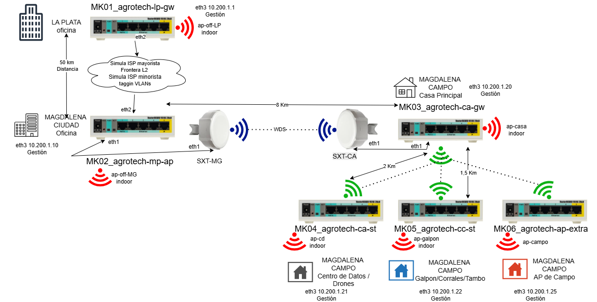

# Análisis Técnico y Estratégico del Proyecto

La propuesta demuestra una **sólida comprensión** de las necesidades de conectividad rural y un uso estratégico de las capacidades de RouterOS/Mikrotik. La estrategia de dividir la red en capas (transporte L2, radioenlaces PtP y PtMP) es robusta y escalable.

### 1. Requerimientos Funcionales Esenciales y Estrategia Aplicada

#### A. Simulación de Transporte Frontera L2 (Q-in-Q - VLAN 201)

| Aspecto | Estrategia Aplicada | Evaluación Técnica |
| :--- | :--- | :--- |
| **Objetivo** | Simular un **enlace troncal de un ISP mayorista** para transportar las VLANs internas del cliente de La Plata a Magdalena. | **Correcto.** El uso de **Q-in-Q (IEEE 802.1ad)** con la **VLAN 201** como *S-VLAN* (Service VLAN) encapsuladora es la técnica estándar para ofrecer servicios de transporte *Ethernet Virtual Private Line* (EVPL) o troncales transparentes a clientes. Permite que las VLANs internas del cliente (*C-VLANs*) viajen sin conflicto a través de la red del proveedor (simulado por el enlace entre MK01 y MK02). |
| **Dispositivos** | MK01 (ISP La Plata) y MK02 (Frontera Magdalena). | Implica una correcta configuración de **VLANs y *Bridge Filtering*** o *Interface List* en los puertos de *backbone* para manejar la doble etiqueta. |

#### B. Radio Enlace PtP MK02 $\leftrightarrow$ MK03 (Simulación 8 km)

| Aspecto | Estrategia Aplicada | Evaluación Técnica |
| :--- | :--- | :--- |
| **Dispositivos** | **SXT G-2HnD** en ambos extremos. | **Decisión técnica crucial y acertada.** El documento adjunto (*enlace\_8Km.md*) justifica perfectamente el **por qué** los **RB951Ui-2HnD** son inadecuados para esta simulación. El SXT ofrece una **antena direccional de 10 dBi** y mayor potencia (hasta **30 dBm**), logrando un **EIRP** (Potencia Isotrópica Radiada Equivalente) de **40 dBm**, indispensable para simular un enlace estable de **8 km** y garantizar la fidelidad del laboratorio.  |
| **Protocolo RF** | **NV2 (Nstreme version 2)**. | **Óptimo para PtP.** NV2 es el protocolo TDMA propietario de Mikrotik, ideal para enlaces punto a punto y multipunto de media/larga distancia. Mejora significativamente el **throughput y la latencia** al gestionar los slots de tiempo, mitigando el problema de la **Hidden Node** (Nodo Oculto) inherente a 802.11 en largas distancias. |
| **Configuración** | **WDS** para transporte transparente de VLANs. | **Correcto.** WDS (Wireless Distribution System) permite que los dispositivos inalámbricos actúen como un **puente de capa 2**, facilitando el transporte de múltiples VLANs (incluida la VLAN 201 que lleva las *C-VLANs*). |

#### C. Radio Enlace PtMP MK03 $\rightarrow$ [MK04, MK05, MK06]

| Aspecto | Estrategia Aplicada | Evaluación Técnica |
| :--- | :--- | :--- |
| **Topología** | **Punto-a-Multipunto (PtMP)**. | **Adecuado para cobertura distribuida.** MK03 actúa como **Access Point (AP)** y los otros como **Stations (CPE)**, típica en la distribución de servicios. |
| **Protocolo RF** | **NV2** y **WDS**. | **Buena práctica.** Mantener NV2 y WDS en el segmento PtMP asegura **uniformidad en el rendimiento** con el PtP y permite que todas las ubicaciones reciban las VLANs corporativas. |

---

### 2. Requerimientos No Funcionales

La estrategia aborda estos requerimientos de la siguiente manera:

* **Enlaces Cifrados y Seguridad:** El documento (*agrotech-rf-v3.md*) menciona el uso de **WPA2**, que es el estándar actual para cifrado robusto en redes WiFi. En un entorno de radioenlaces, esto se traduce en usar **WPA2/WPA3-PSK o Enterprise (RADIUS)** en la interfaz inalámbrica para cifrar todo el tráfico RF (capa 2). Esto cumple el requerimiento.
* **Estabilidad y Calidad de Servicio (QoS):** La elección de **NV2** impacta directamente en la estabilidad y la latencia. Para **QoS**, RouterOS permite la implementación de **queues (simples o tree)** y la clasificación de tráfico mediante **Firewall Mangle** (marcación DSCP/ToS) para priorizar servicios críticos (ej. Voz sobre IP o datos de sensores IoT). Es un punto clave para optimizar.
* **Monitoreo y Gestión de Eventos:** El uso de Mikrotik permite la gestión centralizada mediante **WinBox** o **WebFig**, y la integración con sistemas de monitoreo externos mediante **SNMP** (Simple Network Management Protocol) o **Syslog**, lo que cumple este requerimiento.

---

### 3. Conclusión del Desarrollo Técnico y Estratégico

La propuesta es **técnicamente superior** y está bien justificada:

1.  **Transporte de Servicio:** El uso de **Q-in-Q (VLAN 201)** resuelve la simulación de transporte L2 de forma profesional y correcta.
2.  **Viabilidad RF:** La insistencia en usar **SXT G-2HnD** para el enlace PtP de 8 km demuestra **rigor de ingeniería**, asegurando que la simulación de rendimiento en el laboratorio sea realista y medible, un factor crítico para el éxito del proyecto.
3.  **Eficiencia de Protocolo:** La selección de **NV2** como protocolo de radioenlace maximiza el *throughput* y la eficiencia espectral, superando las limitaciones del 802.11 estándar para este tipo de topología.

> **Recomendación para la Puesta en Producción:** La clave para el éxito del enlace PtP de 8 km será la **alineación precisa** de los SXT y el ajuste fino de la potencia de transmisión (Tx Power) para lograr una señal óptima (idealmente entre **-55 dBm y -65 dBm**) y un bajo *Noise Floor* (*Piso de Ruido*).

