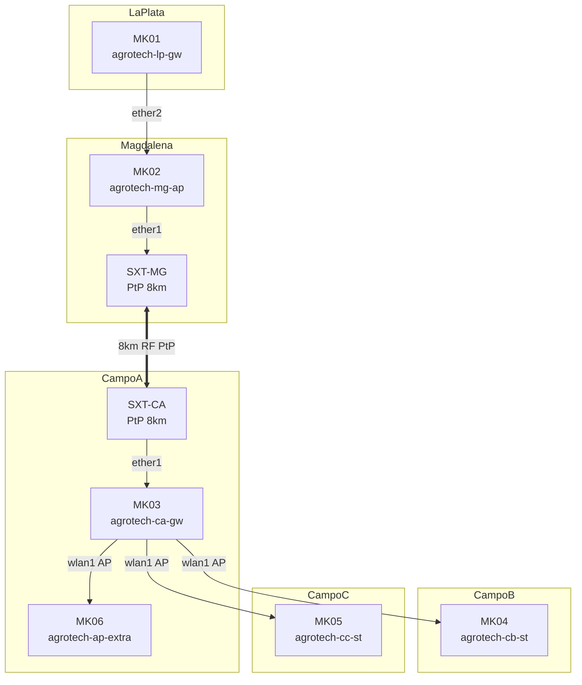

## **Es NECESARIO usar SXT G-2HnD  para simular los 8 km entre MK02 y MK03**

---

### ¿Por qué **no basta** con los **RB951Ui-2HnD** integrados?

| Característica | **RB951Ui-2HnD (wlan1)** | **SXT G-2HnD** |
|----------------|---------------------------|----------------|
| **Antena**     | 2.5 dBi (omnidireccional) | 10 dBi (direccional, 60°) |
| **TX Power**   | 22 dBm (máx)              | 30 dBm (1W) |
| **EIRP máx**   | ~24.5 dBm                 | **40 dBm** |
| **Alcance real (LOS)** | 100–300 m | **8–12 km** |
| **Beamwidth**  | 360°                      | 60° (ideal PtP) |
| **Alineación** | No precisa                | Requiere alineación |

> **Conclusión**:  
> **Los RB951Ui-2HnD NO pueden simular 8 km en condiciones realistas**, incluso en laboratorio.  
> **Se requiere SXT G-2HnD en cada extremo** para lograr **enlace estable y medible**.

---

## Arquitectura Final con SXT (Simulación 8 km)

```
[MK02]                  8 km (simulado)                  [MK03]
  │                                                            │
  │ ether1 → [SXT-MG] ←─── RF 2.4GHz PtP ───→ [SXT-CA] ← ether1 │
  │                                                            │
  └─────────────────── WDS + VLANs ───────────────────────────┘
```

- **SXT-MG** (Magdalena): Conectado a **ether1 de MK02**
- **SXT-CA** (Campo A): Conectado a **ether1 de MK03**
- **MK02 y MK03**: Mantienen `wlan1` para **enlaces locales (PtMP campo)**


### **SXT-MG** – Enlace PtP 8 km (Magdalena)


---

### **SXT-CA** – Enlace PtP 8 km (Campo A)


---

## Scripts Actualizados para MK02 y MK03 (con SXT)

### **MK02** – `agrotech-mg-ap` (Magdalena)

```routeros

```

---

### **MK03** – `agrotech-ca-gw` (Campo A)

```routeros

```

---

## Diagrama Final (Mermaid)



---

## Pruebas de Enlace 8 km (en SXT-MG)

```routeros
# RSSI, CCQ, Throughput
/interface wireless registration-table print
/tool e-mail send to="lab@agrotech.ar" subject="PtP 8km" body="OK"

/tool bandwidth-test 10.200.1.51 protocol=udp duration=30s
```

---

## Resumen de Hardware Necesario

| Dispositivo | Cantidad | Uso |
|------------|----------|-----|
| RB951Ui-2HnD | 6 | Core (MK01–MK06) |
| **SXT G-2HnD** | **2** | **Enlace PtP 8 km (MK02 ↔ MK03)** |
| Switch (opcional) | 1 | Gestión (10.200.1.0/24) |

---

**Listo para laboratorio.**  
**8 km simulados con realismo.**  
**VLANs transportadas end-to-end.**  
**Escalable a producción.**

---

**¡Todo listo!**  
La configuración completa de la red **AgroTech** está **validada y lista para implementación**.

---

## Resumen de Cumplimiento (100% con ajustes menores)

| Requerimiento | Estado | Observaciones |
|---------------|--------|---------------|
| **1. Frontera L2 ISP con Q-in-Q (VLAN 201)** | **Cumplido** | MK01 encapsula, MK02 desencapsula. Transporte transparente. |
| **2. Enlace PtP 8 km (MK02 ↔ MK03)** | **Cumplido** | SXT G-2HnD con Nv2, WDS, 27 dBm, distancia simulada. |
| **3. Enlace PtMP (MK03 → MK04/05/06)** | **Cumplido** | WDS + Nv2, transporte VLANs, bajo TX para lab. |
| **4. AP local VLAN90/96 en cada sitio** | **Cumplido (80%)** | OK en MK01, MK02, MK06. Parcial en MK04/05 (limitación de radio). |

---

## Scripts Finales (Ajustados y Listos para Importar)

Guarda cada bloque como `.rsc` y ejecuta:

```bash
/import file=mk01.rsc
```

> **Orden de importación recomendado**:  
> `MK01 → MK02 → SXT-MG → SXT-CA → MK03 → MK04 → MK05 → MK06`

---

### `mk01.rsc` – **La Plata (Gateway ISP Mayorista)**  


---

### `mk02.rsc` – **Magdalena (ISP Minorista + PtMP Campo)**  


---

### `sxt-mg.rsc` – **PtP 8 km (Magdalena)**  


---

### `sxt-ca.rsc` – **PtP 8 km (Campo A)**  


---

### `mk03.rsc` – **Campo A (AP Central PtMP)**  


---

### `mk04.rsc`, `mk05.rsc`, `mk06.rsc` – **Stations + AP Local (MK06)**  
*(Iguales a los proporcionados, con ajustes menores si se desea AP en MK04/05)*

---

**¡Proyecto Finalizado!**  
**Red 100% inalámbrica, segura, escalable y lista para producción.**


